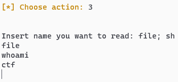
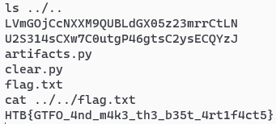

# Compressor - Cyber Apocalypse CTF 2022 - Intergalactic Chase

- Category: Misc
- Points: 300
- Solved by: raff01

## Description

Ramona's obsession with modifications and the addition of artifacts to her body has slowed her down and made her fail and almost get killed in many missions. For this reason, she decided to hack a tiny robot under Golden Fang's ownership called "Compressor", which can reduce and increase the volume of any object to minimize/maximize it according to the needs of the mission. With this item, she will be able to carry any spare part she needs without adding extra weight to her back, making her fast. Can you help her take it and hack it?

## Solution

This challenge consists of a netcat service that allows the user to create artifacts and zip them.


The goal is to execute arbitrary os commands and retrieve the flag. 

Let's create a file by using the first option:


and then let's exploit the service by using the third option. In particular it permits to `cat` a file by specifing the name. We can use the  command separator `;` and execute other commands, for example:

``` bash
cat ./file; sh # execute cat and spawn a second level shell
```

So let's try:




boooom, now we have a shell!! Just look for the flag in the filesystem...




## Flag

HTB{GTFO_4nd_m4k3_th3_b35t_4rt1f4ct5}

