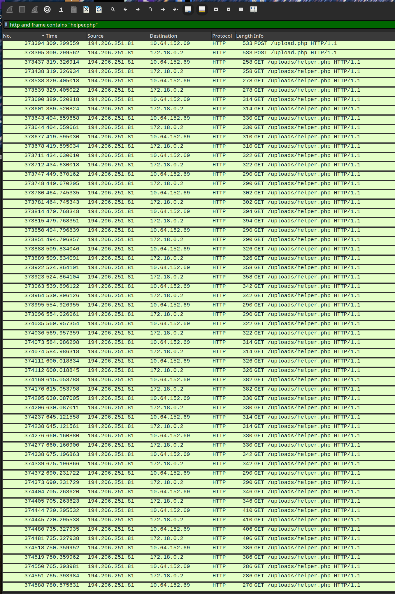
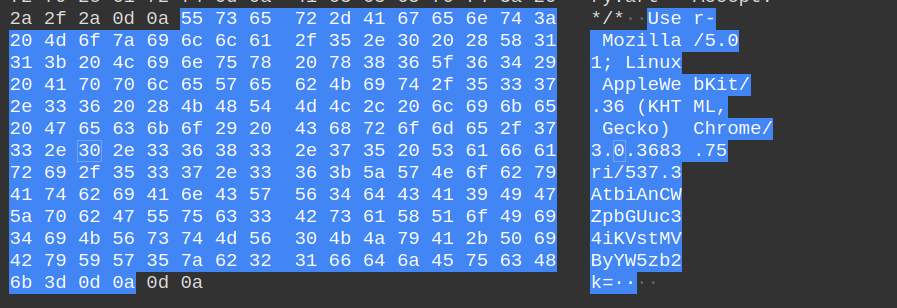
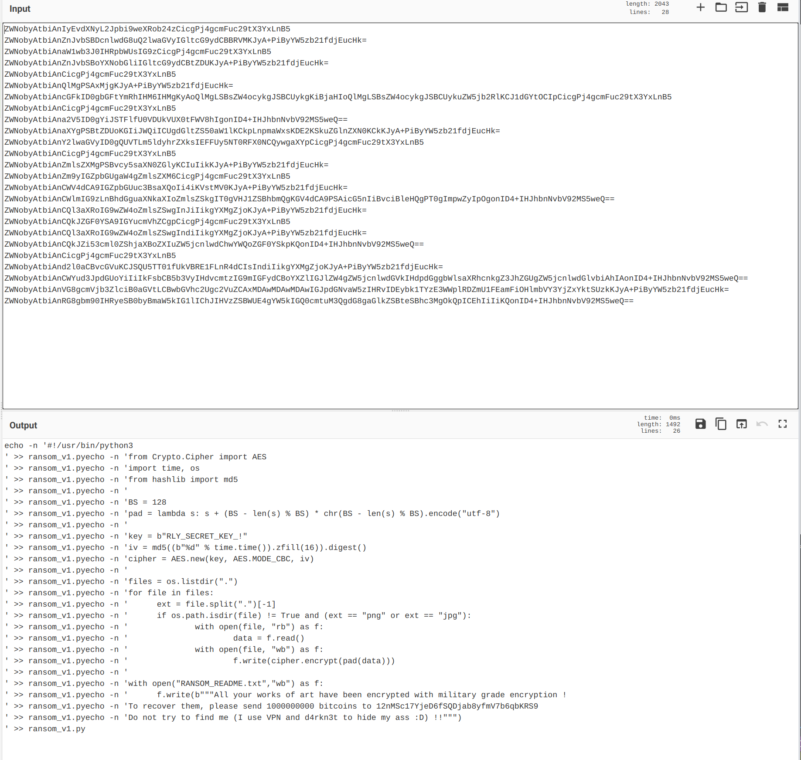

# Art Gallery - dvCTF 2021

- Category: Forensics
- Solved by: hdesk

## Description

Alert! A famous online art gallery has just suffered an intrusion! The hacker has deployed a ransomware and demands an exorbitant ransom to return all of the gallery's data... Fortunately, their teams had the presence of mind to capture the network at the time of the attack! You must help them recover their art, at least their most famous, "Flag sur fond de soleil couchant". Its value is inestimable... Be careful, this pirate seems methodical and experienced! Tracing a precise history of the attack should help you see more clearly!

## Solution

A pcap file is provided. Looking at the http traffic on port 80 we can see there's a lot of it coming from automated tools, and it seems to brings us nowhere. Looking more carefully there are a lot of requests to /uploads/helper.php



The interesting thing here is that in each request the UserAgent field contains a Base64 encoded string:



Decode those lines one by one


The attacker apparently found an RCE on the server, and used it to encrypt the picture, with a known secret key.
We now just have to decode the picture, using the attached script:

```
import base64
from Crypto import Random
from Crypto.Cipher import AES

class AESCipher(object): //Thanks StackOverflow

    def __init__(self, key): 
        self.bs = AES.block_size
        self.key = key

    def decrypt(self, enc):
        iv = enc[:AES.block_size]
        cipher = AES.new(self.key, AES.MODE_CBC, iv)
        return cipher.decrypt(enc[AES.block_size:])

        
f = open('flag_sur_fond_de_soleil_couchant.jpg', 'rb')
enc = f.read()
f.close()
key = b"RLY_SECRET_KEY_!"
c = AESCipher(key)
dec = c.decrypt(enc)
g = open('dec.jpg', 'wb')
g.write(dec)
g.close()

```

Great! We have an illegible picture! Not a problem though, by opening it with an hex editor and deleting the first 30-something bytes until the real JPEG magic byte we can restore it easily

