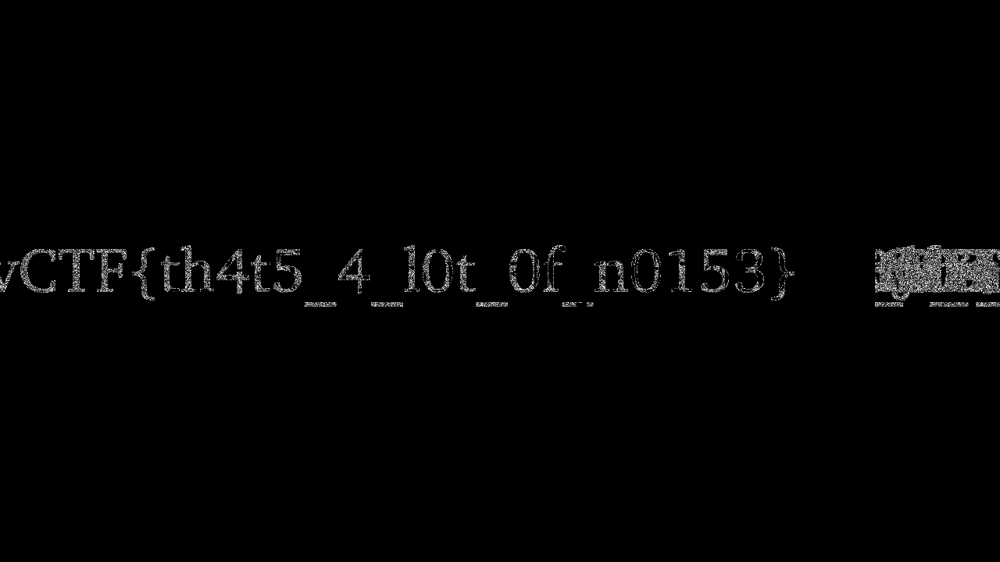

# Read - DaVinciCTF

- Category: Stega
- Points: 10
- Solves: 131
- Solved by: raff01

## Description

Just read!!

## Analysis

In this challenge we'are given an image called "flag.png". The description says "Just read!!" so probably the flag is hidden in the image somehow. Let's analyse the image with a Steganographic tool like Stegsolve. If we slide the varoius planes we won't find anything but if we pay attention to the center of the image we can notice something strange, probably it's the flag!

## Solution

Let's analyse the image with the stereogram solver of Stegsolve. This tool permits us to set the offset. If we increment it we can see that somothig is appearing in the center of the image. If we set the offset to 160 we will obtain the flag!

## Flag

`dvCTF{th4t5_4_l0t_0f_n0153}`