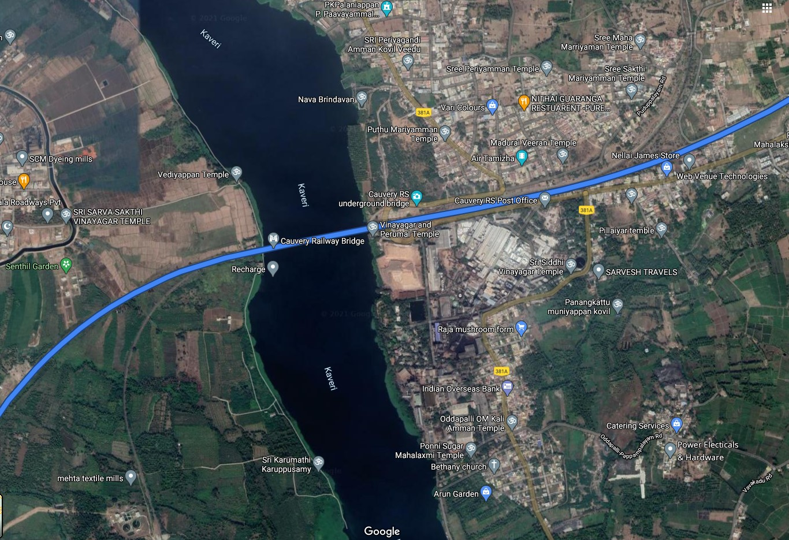
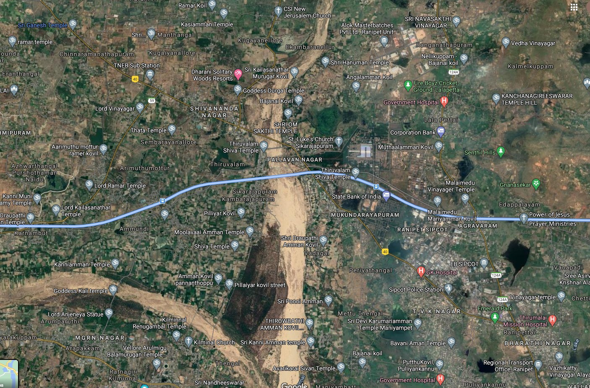
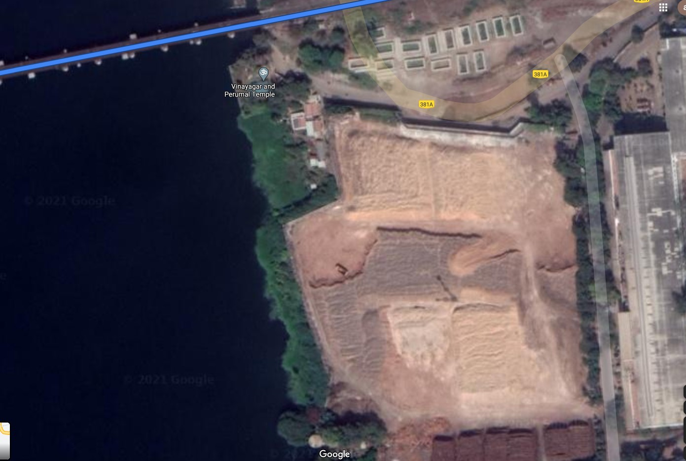
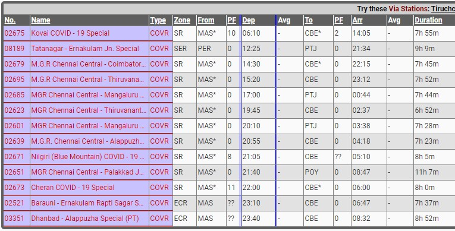

# Travel to the home - DarkCON 2021

- Category: OSINT
- Points: 448
- Solves: 78
- Solved by: drw0if, iregon, hdesk

## Problem

```
I Travelled from MAS to CBE at 10 Jan 2020 (Any direction) and i took a beautiful picture while travelling
Find the Exact location (co-ordinates upto 2 decimal point) and approximate time while i took the pick
Flag format will be {lat,long,time} for time it is 1 hour duration like (01-02)
Flag Format: darkCON{1.11,1.11,01-02}
Hint: Don't brute as maybe you could miss something on location , Find the time correctly and location
```
Along with the problem we were also given an [image](pictures/chall.jpg).

## Solution

The solution search is divided into two parts:

### 1. The position (lat and long)

Googling 'MAS to CBE' we discover that they are the codes of two railway stations in India ([Google Maps](https://www.google.com/maps/dir/Puratchi+Thalaivar+Dr.+M.G.+Ramachandran+Central+Railway+Station,+Kannappar+Thidal,+Periyamet,+Chennai,+Tamil+Nadu+600003,+India/Coimbatore+Junction,+Gopalapuram,+Coimbatore,+Tamil+Nadu,+India/@12.061333,78.053965,289406m/data=!3m2!1e3!4b1!4m14!4m13!1m5!1m1!1s0x3a5265ffa1216265:0x47ee704562150916!2m2!1d80.2754809!2d13.0824723!1m5!1m1!1s0x3ba859a0dc91d4a1:0x98d79c10cc83331f!2m2!1d76.9669917!2d10.9959474!3e3)):


From the [image](pictures/chall.jpg) we have been given with the problem, we can notice three details:
1. in the image the railroad passes over what looks like a river;
2. on the right side there is a factory that seems to be of the mining sector;
3. in the lower left corner is what looks like a temple with a building with a green roof.

There are only 2 points along the train route that pass over a river:

Point 1                      | Point2
:---------------------------:|:----------------------------:
 | 

In point 1 we can see the presence of a structure similar to a quarry (so mining activity) and a temple with a building with a green roof:



BINGO! We found the point from where the photo was taken and it is lat: **11.34** and long: **77.75** ([link](https://goo.gl/maps/2EPa7Rg7JM3hff1W9))

### 2. The time

Looking for all available trains at 10 Jan 2020 ([link](https://indiarailinfo.com/search/mas-mgr-chennai-central-to-cbe-coimbatore-junction/35/0/41?&qt=0&date=15786144&kkk=1614087130779)) for the route from MAS to CBE we got:



Excluding trains that do not depart from MAS and arrive at CBE and that run at night, we concluded that the time the photo was taken should be between 9 a.m. and 11 a.m. (at 10 Jan 2020, the sunrise was at 07:15 and the sunset was at 17:42 at New Delhi).

## Conclusion

So the possible flags could be 2:
1. `darkCON{11.34,77.75,09-10}`
2. `darkCON{11.34,77.75,10-11}`

We inserted, for no apparent reason, first the flag `darkCON{11.34,77.75,10-11}` and, it worked.

## Flag
```
darkCON{11.34,77.75,10-11}
```