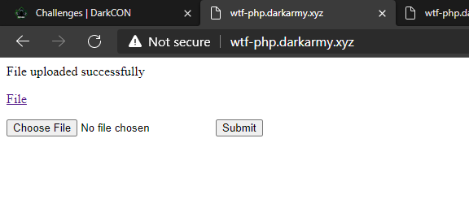
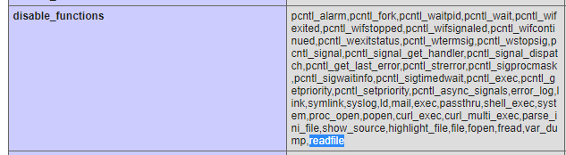
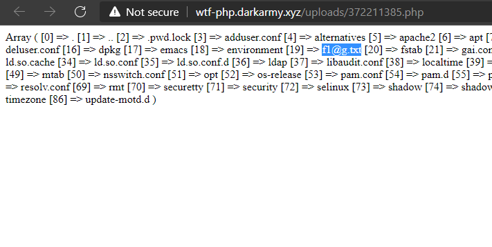

# WTF PHP - DarkCON 2021

---

Category: Web
Points: 269
Solves: 254
Solved by: RxThorn

---

```
Your php function didnt work? maybe some info will help you xD
PS: Flag is somewhere in /etc
Note: This chall does not require any brute forcing
```



## Solution

The solution has been easier than the organizers would think!

In this challenge we were able to upload PHP files and execute them. The description suggested using phpinfo() to retrieve information, so we did. The `readfile` function was blocked... but they forgot to block `file_get_contents`!



Once we figured it out, we scanned `/etc` with `scandir($dir)` and found a file named `f1@g.txt`. So we used `file_get_contents` to get its content and we got the flag: `darkCON{us1ng_3_y34r_0ld_bug_t0_byp4ss_d1s4ble_funct10n}`



### Extra

As the flag (and the description) suggested, if the functions to open the file were blocked, a bug to bypass the `disable_functions` could have been used. I didn't know about this bug, but this challenge gave me something to study.
