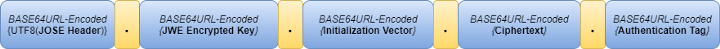
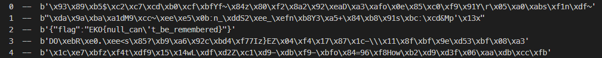

# NULL - EKOPARTY CTF 2022

- Category: Web
- Points: 474
- Solves: 125
- Solved by: Iregon

## Description

```

```

## Solution

From this challenge we have no external links to inspect, so we inspect the CTF platform for any hints.

Looking in the cookies we found an interesting cookie with the same name as the challenge (`NULL`) and the value was:

```
.eJwtj8uOgjAARf-la9OUZyk7NROFARQYHHaEQpUir0ARcTL_PjWZ5bk5i3N_QNHPnRhXYAPnaws2gIkqE_2ddXIpiVbqmFiKfqUqxczA6pVoiGkm1XSGDanXC5MiW92KHgp-4u49Tx3u7d2Gtv6bd36dqBEKAqdDENLjZ0GiKAjjpL7ssidc1vP347mIyzkmQ_BImps356fplfZr7PpmOn7E-KikxPQ46aP5Vu_jYdrCOezaLX01xWJVazfSA40xCWVP0xd5A2y0ASNre8EyPsg-S4WmAjUFGkg6guVtxktgawb-py5v3z9GhMQkeMHB7x8--llu.Y2KtWw.JA6OFApFa2zbeWpBUOY-XX_3nLA
```

It seems to be a JWT token but the structure is not correct.

So we decided to try to decode from base64 every part of the token separately.

The first part contains the following data:

```json
{
  "country": "ITA",
  "eth_token": "d93d479814fb2b7e572f930e36b34e75",
  "jwe": "eyJhbGciOiJkaXIiLCJlbmMiOiJBMjU2R0NNIn0..bHKc9RRNQSUjVB_x.wyPWvxwtVPS9pNvUlgLuaOszXoySJM6XrES7H1X96Li9oRugjCSpsA.uQnmAbzlcw8hynrbGbS79Q",
  "local": 0,
  "remote_ip": "REDACTED",
  "team_id": 357,
  "team_name": "r00tstici"
}
```

After a long time looking after what is the `eth_token` without success, we notice the JWE token in the `jwe` field.

After a bit of research we discover that a JWE token is built with five key components:



Source: https://medium.com/aeturnuminc/encrypt-and-decrypt-sensitive-data-with-jwe-70421722f7e5

But in our token, the encryption key is missing, this means that the encryption probably used was the NULL key, and this is exactly what the challenge description said.

Looking at the header of the token, we know that the algorithm used for the encryption is `AES-256-GCM`:

```json
{ "alg": "dir", "enc": "A256GCM" }
```

After research, we discover that this algorithm use `AES-256-CTR` for the decrypt, `AES-256-GCM` "only" provides an integrity check before the decrypt, performed with the `Authentication Tag`.

The last thing to do now is to write a little script for the token decryption:

```py
from Crypto.Cipher import AES
from base64 import b64decode

encrypted = b64decode('wyPWvxwtVPS9pNvUlgLuaOszXoySJM6XrES7H1X96Li9oRugjCSpsA==')
key = b'\x00'*32
iv = b64decode('bHKc9RRNQSUjVB_x=')

for i in range(0, 100):
    aes_ctr = AES.new(key, AES.MODE_CTR, nonce=iv, initial_value=i)
    plaintext = aes_ctr.decrypt(encrypted)
    print(i, ' -- ', plaintext)
```

The output of this script doesn't contain the flag.

After a headache and a lot of things tried, we discovered that the function `b64decode()` doesn't return the correct output: our base64 is coded with the URL safe version of the `RFC 4648` and not the standard version.

- base64: `bHKc9RRNQSUjVB_x=`
- the expected decode in hex: `6c729cf5144d412523541ff1`
- the decoded we obtain in hex: `6c729cf5144d412523541c`

We decided to convert the decoded base64 to hex manually, and now we have:

```py
from Crypto.Cipher import AES

encrypted = bytes.fromhex("c323d6bf1c2d54f4bda4dbd49602ee68eb335e8c9224ce97ac44bb1f55fde8b8bda11ba08c24a9b0")
key = b'\x00'*32
iv = iv = bytes.fromhex("6c729cf5144d412523541ff1")

for i in range(0, 100):
    aes_ctr = AES.new(key, AES.MODE_CTR, nonce=iv, initial_value=i)
    plaintext = aes_ctr.decrypt(encrypted)
    print(i, ' -- ', plaintext)
```

Launching the script, this time we have the flag in the output:



## Flag

```
EKO{null_can't_be_remembered}
```
