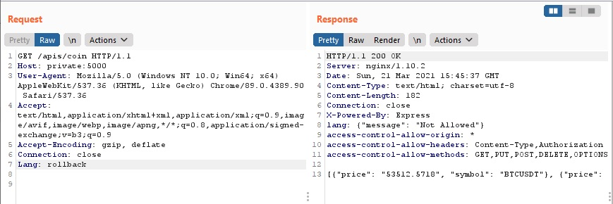
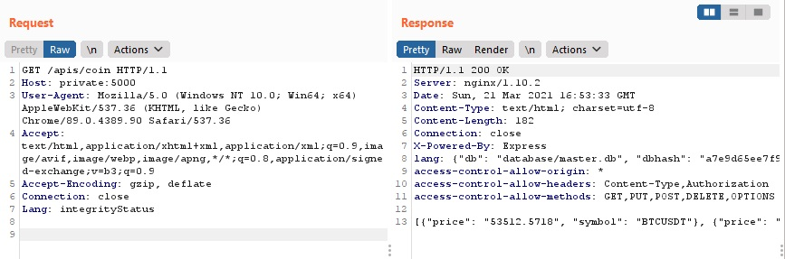
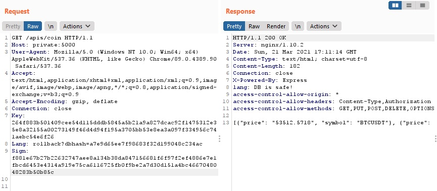
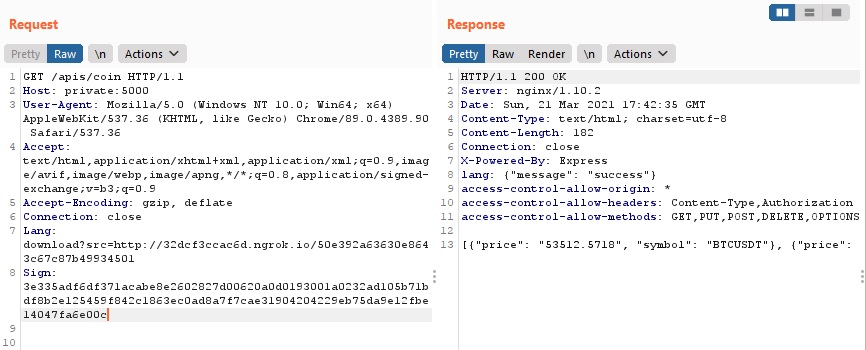
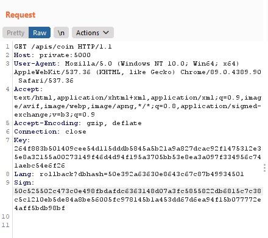

# diveinternal - LineCTF

- Category: Web
- Points: 50
- Solves: 65
- Solved by: SM_SC2, Iregon, raff01

## Description

Target the server's internal entries, access admin, and roll back.

Keytime: Asia/Japan

## Analysis

We have three services:
- `public`: flask web application (http://35.200.63.50/)
- `private`: node.js web application (http://private:5000/)
- nginx proxy server

Only public service is accessible to us.

As the name and the description suggest, the challenge can be solved with an SSRF attack. Looking at the code, opening `private/app/templates/index.html`, we can read `This is ssrf munjae internal progran`. So we are certain of the attack to do.
At this point, we have to find the flag and a way to obtain it.

## Solution

### 1. FIND THE POINT OF CONTACT
Searching for the flag inside the private directory, we can see `FLAG` file. Also, this file is read from the `RunRollbackDB` function at `private/app/rollback.py`.

```python
def RunRollbackDB(dbhash):
    try:
        if os.environ['ENV'] == 'LOCAL':
            return
        if dbhash is None:
            return "dbhash is None"
        dbhash = ''.join(e for e in dbhash if e.isalnum())
        if os.path.isfile('backup/'+dbhash):
            with open('FLAG', 'r') as f:
                flag = f.read()
                return flag
        else:
            return "Where is file?"
```

This function is called by `Commit` and `IntegrityCheck` functions in `main.py`, but only the second one returns the flag to the caller...

```python
def IntegrityCheck(self,key, dbHash): 
        if self.integrityKey == key:
            pass
        else:
            return json.dumps(status['key'])
        if self.dbHash != dbHash:
            flag = RunRollbackDB(dbHash)
            logger.debug('DB File changed!!'+dbHash)
            file = open(os.environ['DBFILE'],'rb').read()
            self.dbHash = hashlib.md5(file).hexdigest()
            self.integrityKey = hashlib.sha512((self.dbHash).encode('ascii')).hexdigest()
            return flag
        return "DB is safe!"
 ```
... and, again, this is called by `IntegrityCheckWorker` and `rollback` functions. As before, only rollback is useful. Also, it's an endpoint.

```python
@app.route('/rollback', methods=['GET'])
def rollback():
```

Now, we need a way to call it from the public service.

Only `public/src/routes/apis.js` seems interesting. It has three public endpoints, each of which, in turn, calls a private endpoint.

| Endpoint   | Access point         |
|------------|----------------------|
| `/`        | headers              |
| `/coin`    | headers              |
| `/addsub`  | query string (email) |

Looking at `private/app/main.py` we have that `LanguageNomarize` function, which is called by `/coin`, uses the `Lang` header to make an HTTP request.

```python
def LanguageNomarize(request):
    if request.headers.get('Lang') is None:
        return "en"
    else:
        regex = '^[!@#$\\/.].*/.*' # Easy~~
        language = request.headers.get('Lang')
        language = re.sub(r'%00|%0d|%0a|[!@#$^]|\.\./', '', language)
        if re.search(regex,language):
            return request.headers.get('Lang')
        
        try:
            data = requests.get(request.host_url+language, headers=request.headers)
            if data.status_code == 200:
                return data.text
            else:
                return request.headers.get('Lang')
        except:
            return request.headers.get('Lang')
```
**WE FOUND THE POINT OF CONTACT!**

### 2. ACCESS TO `/rollback`

`re.sub(r'%00|%0d|%0a|[!@#$^]|\.\./', '', language)` doesn't allow us to do path traversal.
Regex `^[!@#$\\/.].*/.*`, instead, permits every type of "standard" HTTP request. So we can call whatever endpoint we want, even using query parameters.

We send an HTTP request to `apis/coin` with the headers:
- `Host: private:500`
- `Lang: rollback`

So we have `request.host_url = http://private:500/` and `language = rollback`.

Before making the request, we must remove all the unnecessary headers to comply with the constraint given by the `before_request` function

```python
@app.before_request
def before_request():
    if str(request.url_rule) not in list_routes():
        return json.dumps(status['error']), 404
    if request.headers.get('Sign') != None:
        if len(request.headers)>8:
            result = status['admin']
            result['message'] = result['message']+str(len(request.headers))
            return json.dumps(result), 404
```
As we can see from `/coin` function code, the response will set the `Lang` header.

```python
@app.route('/coin', methods=['GET'])
def coin():
    try:
        response = app.response_class()
        language = LanguageNomarize(request)
        response.headers["Lang"] =  language
        data = getCoinInfo()
        response.data = json.dumps(data)
        return response
    except Exception as e :
        err = 'Error On  {f} : {c}, Message, {m}, Error on line {l}'.format(f = sys._getframe().f_code.co_name ,c = type(e).__name__, m = str(e), l = sys.exc_info()[-1].tb_lineno)
        logger.error(err)
```


We received the message `{"message": "Not Allowed"}`. It comes from `/rollback` function (`status['sign']`). We are inside!


### 3. `SignCheck` BYPASS

Let's analyse the function.

```python
@app.route('/rollback', methods=['GET'])
def rollback():
    try:
        if request.headers.get('Sign') == None:
            return json.dumps(status['sign'])
        else:
            if SignCheck(request):
                pass
            else:
                return json.dumps(status['sign'])

        if request.headers.get('Key') == None:
            return json.dumps(status['key'])
        result  = activity.IntegrityCheck(request.headers.get('Key'),request.args.get('dbhash'))
        return result
    except Exception as e :
        err = 'Error On  {f} : {c}, Message, {m}, Error on line {l}'.format(f = sys._getframe().f_code.co_name ,c = type(e).__name__, m = str(e), l = sys.exc_info()[-1].tb_lineno)
        logger.error(err)
        return json.dumps(status['error']), 404
```

It requires a `Sign` header. Also, there is a `SignCheck`.

```python
def SignCheck(request):
    sigining = hmac.new( privateKey , request.query_string, hashlib.sha512 )

    if sigining.hexdigest() != request.headers.get('Sign'):
        return False
    else:
        return True
```
As we can see, the sign consists of sha512 of the `query_string` parameters. In addition, it requires a `private_key`. Fortunately, we have it.

It's time to use `docker-compose up --build`. Before doing this, we have to add some logging to obtain the Sign. Also, we have to modify `private/app/coinapi.py` so it returns fake data.

So, let's launch the containers, send the HTTP request to localhost using a random Sign and get what will be logged.

Now we can resend the request to the real server with the updated Sign...<br>
... and receive `{'message': 'Key error'}`.

### 4. `Key` BYPASS
The service requires a `Key` header. Then it calls `activity.IntegrityCheck(request.headers.get('Key'),request.args.get('dbhash'))`.
So, we need also the `dbhash` query parameter.

Let's analyse `IntegrityCheck`

```python
def IntegrityCheck(self,key, dbHash): 
        if self.integrityKey == key:
            pass
        else:
            return json.dumps(status['key'])
        if self.dbHash != dbHash:
            flag = RunRollbackDB(dbHash)
            logger.debug('DB File changed!!'+dbHash)
            file = open(os.environ['DBFILE'],'rb').read()
            self.dbHash = hashlib.md5(file).hexdigest()
            self.integrityKey = hashlib.sha512((self.dbHash).encode('ascii')).hexdigest()
            return flag
        return "DB is safe!"
```
We need a valid key. Looking at the code, we see that the key is updated by the `UpdateKey` function, called by `IntegrityCheck` and `Commit`.

```python
def UpdateKey(self):
        file = open(os.environ['DBFILE'],'rb').read()
        self.dbHash = hashlib.md5(file).hexdigest()
        self.integrityKey = hashlib.sha512((self.dbHash).encode('ascii')).hexdigest()
```

**We have a problem!** We need the md5 of the remote db (`dbHash`).

Fortunately, there is `/integrityStatus` which provides it.



Call [key_gen.py](key_gen.py) script using the obtained `dbHash` and get the `Key`.

Add the key to the header, add `dbHash` to `Lang` as query parameter of `/rollback` and update the `Sign`.



A new error: `DB is safe!`

### 5. `dbHash` BYPASS
The error is generated by `IntegrityCheck`.

We need a `dbHash` different from the one which has generated the key. The main problem is that the `RunRollbackDB` function inside `private/app/rollback.py` needs a `dbHash` that matches a valid backup file.

```python
def RunRollbackDB(dbhash):
    try:
        if os.environ['ENV'] == 'LOCAL':
            return
        if dbhash is None:
            return "dbhash is None"
        dbhash = ''.join(e for e in dbhash if e.isalnum())
        if os.path.isfile('backup/'+dbhash):
            with open('FLAG', 'r') as f:
                flag = f.read()
                return flag
        else:
            return "Where is file?"
```

Looking at the code, again, we have the `WriteFile` function called by `/download` private endpoint.

```python
def WriteFile(url):
    local_filename = url.split('/')[-1]
    with requests.get(url, stream=True) as r:
        r.raise_for_status()
        with open('backup/'+local_filename, 'wb') as f:
            for chunk in r.iter_content(chunk_size=8192):
                f.write(chunk)
```

Thanks to `url.split('/')[-1]`, we need a custom service having an endpoint that ends with the filename we want to create.
For example `http://hostname/50e392a63630e8643c67c87b49934501`. So we can create a simple PHP script inside a folder with that name.

Unfortunately, `/download` needs a `Sign`, so we have to obtain a new one.



### 6. GET THE FLAG



## Flag

`LINECTF{YOUNGCHAYOUNGCHABITCOINADAMYMONEYISBURNING}`