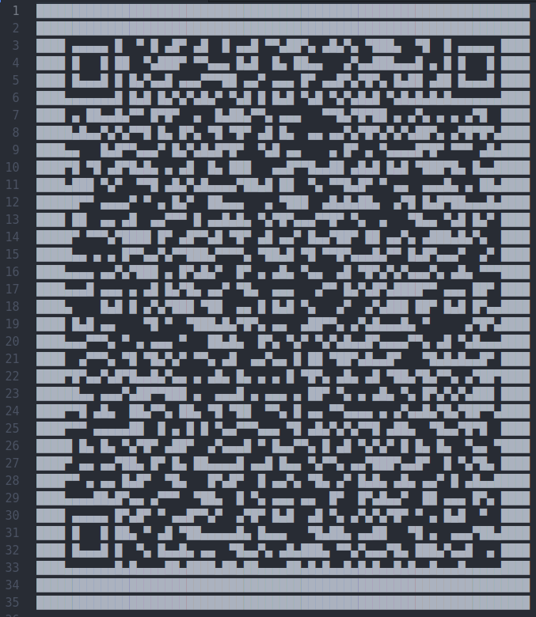

# Poeta Errante Chronicles

Category: Misc

Points: 100

Solved by: staccah_staccah

## Problem

Description: The space-time coordinates bring R-boy to Florence in 1320 AD. Zer0 has just stolen the unpublished version of the "Divine Comedy" from its real author, the "Wandering Poet", giving it to his evil brother, Dante.
Help the "Wandering Poet" recover his opera and let the whole world discover the truth.


## Writeup

We were provided with an ip and a port. When we connected to it with netcat we discovered that the challenge was about an old style text adventure in which we were forced to answer some questions in a specific way to keep going on
Main challenge is composed by 3 sub-challenges:

###  #1 Challenge

It gaves us a weird document composed by hex characters (first_challenge.txt).

When we cleaned the text we tried various conversions, the right one was unicode interpretation.

The result is a QR code composed by unicode characters, translated it there was a basic ID card whose "address" field was the answer to our riddle:
"Where are we going?": Via Vittorio Emanuele II, 21


### #2 Challenge

We had to guess a 4 digit code helped by some hints in form of a very known riddle:

```3871    1 correct digit and in right position
4170    1 correct digit and in wrong position
5028    2 correct digits and in right position
7526    1 correct digit and in right position
8350    2 correct digits and in wrong position
```
Insert the code: 3029

### #3 Challenge

Another hexdump was printed (third_challenge.txt), this time it was similar to network packets and the hint in the text:

```This communication method is something never seen in this epoch. It's not really
like sending a big, whole, message, but, instead, dived it in little p...ieces,
and send them one at time...
```

Confirmed it. So we imported the pcap with [text2pcap](https://www.wireshark.org/docs/man-pages/text2pcap.html) and opened it in wireshark. There was a communication captured inside it and reading the packet in the right order we got the flag:
`{FLG:i7430prrn33743<}`
