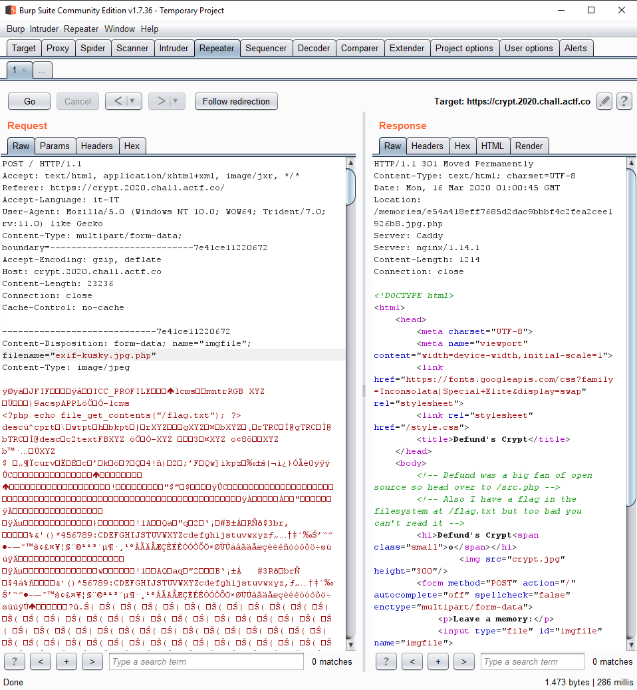
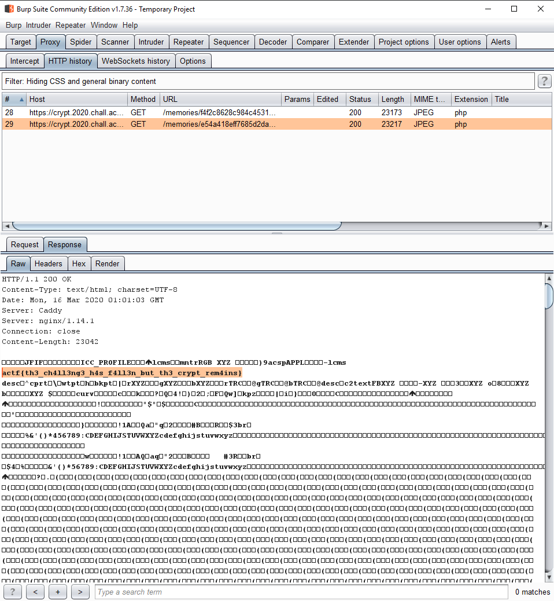

# Defund's Crypt
### Category: web
### Description:
One year since defund's descent. One crypt. One void to fill. Clam must do it, and so must you.
### Author: aplet123

### Solution:
When we went to the site we immediately analyzed the HTML code, inside it we got two hints:

- the flag file is in the root directory `/flag.txt`
- the source code is at `/src.php` of the website

So let's get the [code](src.php) and analyze it:
As the frontend asks we know that we can upload a picture, in particular `.jgp`, `.png` and `.bmp` images.
There are tons of checks like the effective existance of a file in the incoming request:
```php
if (
    !isset($_FILES['imgfile']['error']) ||
    is_array($_FILES['imgfile']['error'])
) {
    throw new RuntimeException('The crypt rejects you.');
}
switch ($_FILES['imgfile']['error']) {
case UPLOAD_ERR_OK:
    break;
case UPLOAD_ERR_NO_FILE:
    throw new RuntimeException('You must leave behind a memory lest you be forgotten forever.');
case UPLOAD_ERR_INI_SIZE:
case UPLOAD_ERR_FORM_SIZE:
    throw new RuntimeException('People can only remember so much.');
default:
    throw new RuntimeException('The crypt rejects you.');
}          
```
one for the file size:
```php
if ($_FILES['imgfile']['size'] > 1000000) {
    throw new RuntimeException('People can only remember so much..');
}
```
and so on.
In particular in this check:
```php
$finfo = new finfo(FILEINFO_MIME_TYPE);
if (false === $ext = array_search(
    $finfo->file($_FILES['imgfile']['tmp_name']),
    array(
        '.jpg' => 'image/jpeg',
        '.png' => 'image/png',
        '.bmp' => 'image/bmp',
    ),
    true
)) {
    throw new RuntimeException("Your memory isn't picturesque enough to be remembered.");
}
```
we are looking for the existance of the mime type of the received file in the array and if it exists we put the extension in `$ext` variable. 
```php
if (strpos($_FILES["imgfile"]["name"], $ext) === false) {
    throw new RuntimeException("The name of your memory doesn't seem to match its content.");
}
```
Here we are checking if the extension based on mime type is present into the filename

After all this checks there is the filename forging:
```php
$bname = basename($_FILES["imgfile"]["name"]);
$fname = sprintf("%s%s", sha1_file($_FILES["imgfile"]["tmp_name"]), substr($bname, strpos($bname, ".")));
```
This code has a huge flaw: the extension is got from the realname so if we sent a file with a composed extension and the right mime type it won't get blocked.
The challenge is also in php so we can upload a php script and reach a local file inclusion for the flag file. Let's try it:

Let's upload a file and send the request to repeater in Burp so we can modify it:

modify the filename appending `.php` at the end of the filename and add the php script for the file inclusion `<?php echo file_get_contents("/flag.txt"); ?>`
and send it:

BOOM we got the flag!
### Flag:
```
actf{th3_ch4ll3ng3_h4s_f4ll3n_but_th3_crypt_rem4ins}
```