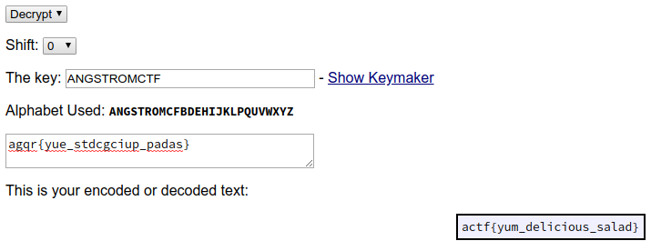

# Keysar
### Category: crypto
### Description:
Hey! My friend sent me a message... He said encrypted it with the key ANGSTROMCTF.

He mumbled what cipher he used, but I think I have a clue.

Gotta go though, I have history homework!!

agqr{yue_stdcgciup_padas}
### Author: joshdabosh

### Solution: 
Looking for a caesar cipher with a word as a key we got with the `Keyed Caesar` on this [site](http://rumkin.com/tools/cipher/caesar-keyed.php) so we put key and cipher text and the flag popped out:


### Flag:
```
actf{yum_delicious_salad}
```