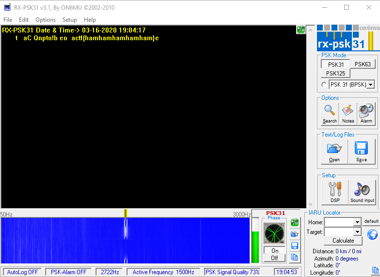

# PSK
### Category: misc
### Description:
My friend sent my yet another mysterious recording...

He told me he was inspired by PicoCTF 2019 and made his own transmissions. I've looked at it, and it seems to be really compact and efficient.

Only 31 bps!!

See if you can decode [what he sent to me](transmission.wav). It's in actf{} format
### Author: JoshDaBosh

### Solution:
As soon as I read PSK I thought about Phase-Shift Keying modulation so I opened the description and read 31, I already heard about PSK-31 so after asking to a radio amateur friend of mine I came up with the attempt to decode it via some kind of PSK-31 software, on windows there are plenty of them, one is called `RX-PSK31`. I installed it, opened in and reproduced the audio via the computer speaker into the connected microphone, shifted the cursor onto the main occupied frequency range and BOOM the flag suddenly appeared on the output text-box



### Flag:
```
actf{hamhamhamhamham}
```