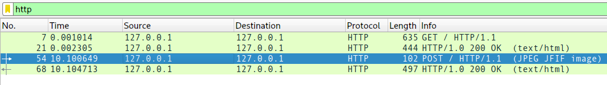

# ws2
### Category: misc
### Description:
No ascii, not problem :)

[recording.pcapng](recording.pcapng)
### Author: JoshDaBosh

### Solution:
Analyzing the tcp dump we can observe that there has been a jpeg upload

let's extract it via wireshark

### Flag:
```
actf{ok_to_b0r0s-4809813}
```