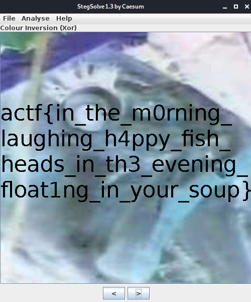

# Fish - ångstromCTF 2021

- Category: Misc
- Points: 60
- Solves: 771
- Solved by: raff01

## Description

Oh, fish! My <u>`dinner`</u> has turned transparent again. What will I eat now that I can't eat that yummy, yummy, fish head, mmmmmm head of fish mm so good...

`Hint` : Is the image really empty?

`Author` : kmh

## Analysis
In this challenge we're given a file called `fish.png`. If we open it we'll see that it's completly blank... but probably there's something hidden in it.

## Solution

Let's analyse the image with a steganographic tool such as Stegsolve. Just set `Colour Inversion (Xor)` and get the flag!



## Flag
```
actf{in_the_m0rning_laughing_h4ppy_fish_heads_in_th3_evening_float1ng_in_your_soup}
```
