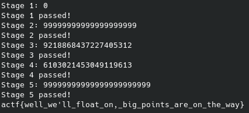

# Float On - angstromCTF 2021

- Category: Misc
- Points: 130
- Solves: 217
- Solved by: drw0if, Iregon, M4ttex00

## Description

I cast my int into a double the other day, well nothing crashed, sometimes life's okay.

We'll all float on, anyway: [float_on.c](dist/float_on.c).

Float on over to `/problems/2021/float_on` on the shell server, or connect with `nc shell.actf.co 21399`.

## Solution

Opening the source code, in the `main` function, we can see a function named `print_flag()` called after the `DO_STAGE` macro is called five times:

```c
int main(void) {
    union cast converter;
    double x;

    DO_STAGE(1, x == -x);
    DO_STAGE(2, x != x);
    DO_STAGE(3, x + 1 == x && x * 2 == x);
    DO_STAGE(4, x + 1 == x && x * 2 != x);
    DO_STAGE(5, (1 + x) - 1 != 1 + (x - 1));

    print_flag();

    return 0;
}
```

Every time that `DO_STAGE` is called, it checks that the number taken in input verify a condition (macro second parameter).

```c
#define DO_STAGE(num, cond) do {\
    printf("Stage " #num ": ");\
    scanf("%lu", &converter.uint);\
    x = converter.dbl;\
    if(cond) {\
        puts("Stage " #num " passed!");\
    } else {\
        puts("Stage " #num " failed!");\
        return num;\
    }\
} while(0);
```

The input number is casted from `uint64_t` to `double` with an union:

```c
union cast {
    uint64_t uint;
    double dbl;
};
```

With the union the casting is made in a "bit wise mode" so, for example, `9218868437227405312` in uint64_t (`111111111110000000000000000000000000000000000000000000000000000` in binary) is casted to `inf` in double.

Then, we solve every stage:

1. `STAGE 1`: the only number equal to its negative is `0` (`0 == -0`);
2. `STAGE 2`: the only "number" that verify the condition `x != x` in `nan`, so we use a number that casted to double is a `nan`, so we used: `99999999999999999999`;
3. `STAGE 3`: the only "number" that does not change if you add 1 or if you multiply it by 2 is `inf`, so we used `9218868437227405312`;
4. `STAGE 4`: we used the number `6103021453049119613`;
5. `STAGE 5`: we thought that a very large number was needed, so we tried with `99999999999999999999999`, and it works.

At the end the flag is printed at video.



## Flag

```
actf{well_we'll_float_on,_big_points_are_on_the_way}
```