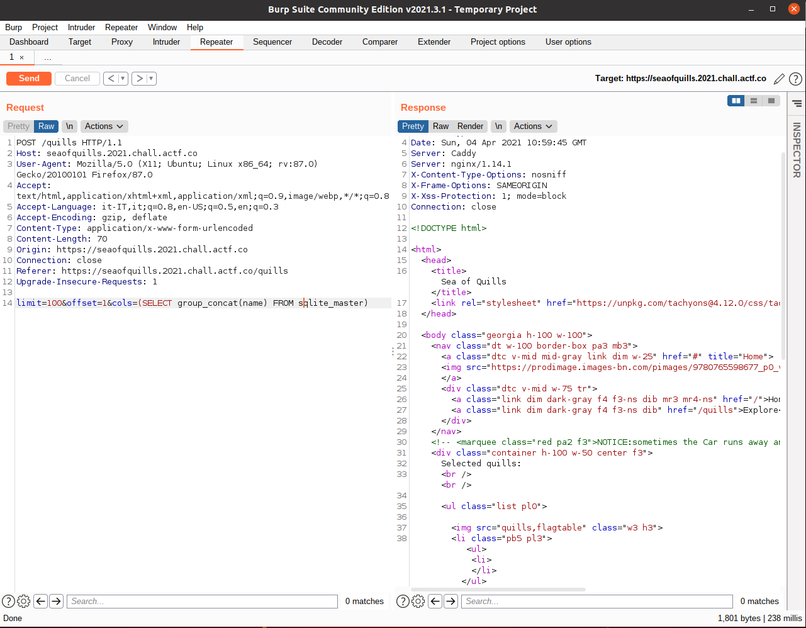
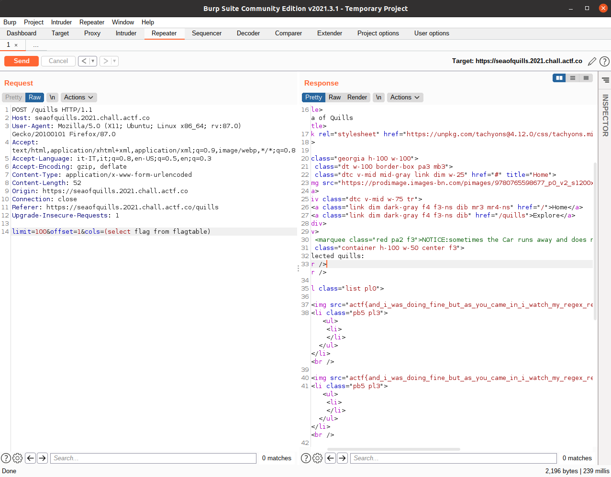

# Sea of Quills - angstromCTF 2021

- Category: Web
- Points: 70
- Solves: 387
- Solved by: Lu191

## Description

Come check out our [finest selection of quills!](https://seaofquills.2021.chall.actf.co/)

[app.rb](dist/app.rb)

## Solution

Looking at the code we can see that there is a blacklist implemented to prevent a sql injection, we know that a blacklist isn't the right choise to prevent the exploitation of a vulnerability, and indeed even here this is the case, in fact there we can still use the parenthesis to manipulate the query.
Having the parenthesis we can use a subquery to get the output we want.
We'll inject our subquery in the "cols" field.

We need first to enumerate the table names of the database.
To do so, the query should be: 

```
SELECT name FROM sqlite_master
```

Now, we can't use this query because we column name should be just one while this query probably returns more than one rows, so we should use the group_concat function to get just one output from the query.

```
SELECT group_concat(name) FROM sqlite_master
```



So there are two tables in this database, `quills` and `flagtable`.
We are interested in `flagtable` table.
So we try to guess the column name of the flag table, trying with `flag`!

```
SELECT flag FROM flagtable
```



## Flag

actf{and_i_was_doing_fine_but_as_you_came_in_i_watch_my_regex_rewrite_f53d98be5199ab7ff81668df}
