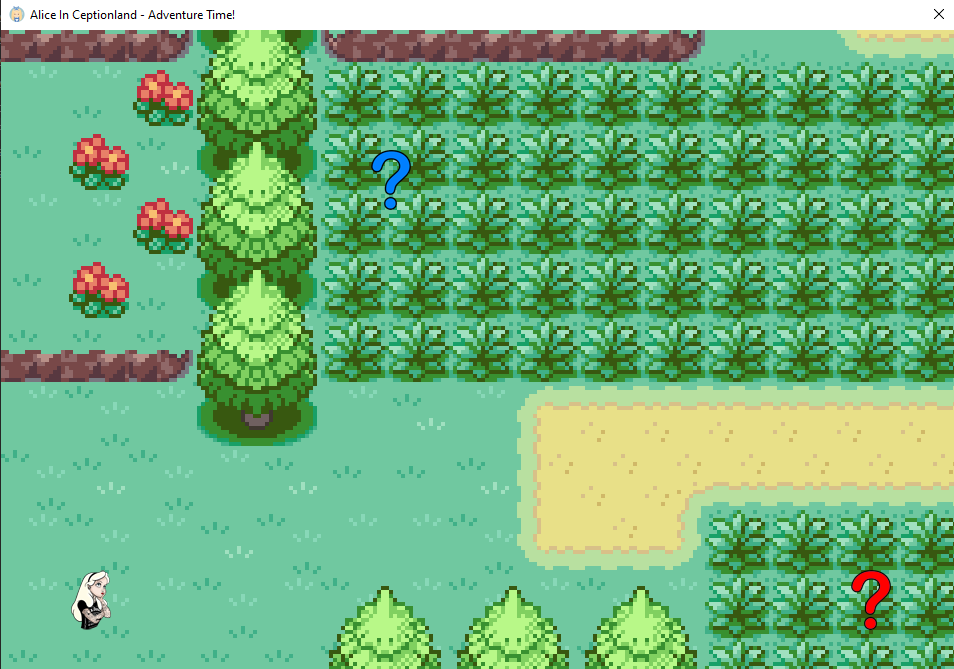

# AliceInCeptionland - corCTF 2021

- Category: Reverse
- Points: 473
- Solves: 56
- Solved by: drw0if - hdesk

## Description

Our dear beloved Alice is undergoing a cerebral attack by some of the fiercest enemies known to man. Quick, get in there and help her!

## Solution

We are given a windows binary, it seems to be a .NET program, in fact when we launch it we get a `.NET Form application`:



We can unpack it with `dnSpy`, let's start with main function:
```c#
private static void Main() {
    Application.EnableVisualStyles();
    Application.SetCompatibleTextRenderingDefault(false);
    BaseGame baseGame = new BaseGame();
    Application.Run(baseGame);
    if (!string.IsNullOrEmpty(baseGame.Foo) && !string.IsNullOrEmpty(baseGame.Bar))
    {
        byte[] iv = null;
        byte[] key = null;
        using (MD5 md = MD5.Create())
        {
            iv = md.ComputeHash(Encoding.ASCII.GetBytes(baseGame.Foo));
        }
        using (SHA256 sha = SHA256.Create())
        {
            key = sha.ComputeHash(Encoding.ASCII.GetBytes(baseGame.Bar));
        }
        using (Aes aes = Aes.Create())
        {
            aes.IV = iv;
            aes.Key = key;
            aes.Padding = PaddingMode.PKCS7;
            ICryptoTransform transform = aes.CreateDecryptor(aes.Key, aes.IV);
            using (MemoryStream memoryStream = new MemoryStream())
            {
                using (CryptoStream cryptoStream = new CryptoStream(memoryStream, transform, CryptoStreamMode.Write))
                {
                    byte[] aliceInCeptiondream = Resources.AliceInCeptiondream;
                    cryptoStream.Write(aliceInCeptiondream, 0, aliceInCeptiondream.Length);
                    cryptoStream.FlushFinalBlock();
                    Application.Run(new DeepDream(Assembly.Load(memoryStream.ToArray())));
                }
            }
        }
    }
}
```

First things first it runs a `BaseGame` object, then it checks for the presence of `baseGame.Foo` and `baseGame.Bar` strings, in the end it decrypts one of the resources attached to the binary file and runs it.

```c#
private void BaseGame_KeyDown(object sender, KeyEventArgs e){
    Point location = this.imgActor.Location;
    if (e.KeyCode == Keys.Left)
    {
        location.X = ((location.X < 60) ? 0 : (location.X - 60));
    }
    else if (e.KeyCode == Keys.Up)
    {
        location.Y = ((location.Y < 60) ? 0 : (location.Y - 60));
    }
    else if (e.KeyCode == Keys.Right)
    {
        location.X = ((location.X >= base.Size.Width - 120) ? location.X : (location.X + 60));
    }
    else if (e.KeyCode == Keys.Down)
    {
        location.Y = ((location.Y >= base.Size.Height - 150) ? location.Y : (location.Y + 60));
    }
    if (location == this.imgFirst.Location && this.imgFirst.Visible)
    {
        base.Visible = false;
        CheshireCat cheshireCat = new CheshireCat();
        if (cheshireCat.ShowDialog(this) != DialogResult.OK)
        {
            base.Close();
            return;
        }
        this.Foo = cheshireCat.Secret;
        this.imgFirst.Visible = false;
        base.Visible = true;
    }
    else if (location == this.imgSecond.Location)
    {
        if (this.imgFirst.Visible)
        {
            location = this.imgActor.Location;
        }
        else
        {
            base.Visible = false;
            Caterpillar caterpillar = new Caterpillar();
            if (caterpillar.ShowDialog(this) != DialogResult.OK)
            {
                base.Close();
                return;
            }
            this.Bar = caterpillar.Secret;
            base.Visible = true;
            base.Close();
        }
    }
    this.imgActor.Location = location;
}
```

This function inside the `BaseGame` class handles the key strokes, in particular it moves the player icon and checks wheter the player reached one of the question mark.

The `imgFirst` launches the `CheshireCat` class and when it is over it is used to get the `Foo` string.

```c#
private void button1_Click(object sender, EventArgs e)
{
    string text = WhiteRabbit.Transform("41!ce1337");
    char[] array = WhiteRabbit.Transform(this.textBox1.Text).Reverse<char>().ToArray<char>();
    for (int i = 0; i < array.Length; i++)
    {
        char[] array2 = array;
        int num = i;
        array2[num] ^= text[i % text.Length];
    }
    if (string.Join<char>("", array.Reverse<char>()).Equals("oI!&}IusoKs ?Ytr"))
    {
        this.Secret = this.textBox1.Text;
        this.label1.Visible = false;
        this.textBox1.Visible = false;
        this.button1.Visible = false;
        this.timer1.Start();
    }
}
```

Let's notice that `WhiteRabbit.Transform` does nothing:
```c#
public static string Transform(string s)
{
    return s;
}
```

We can pass the check inside this class with this simple snippet:
```python
text = bytearray(b'41!ce1337')
array = bytearray(b'oI!&}IusoKs ?Ytr'[::-1])

for i in range(len(array)):
    array[i] ^= text[i % len(text)]

foo = array[::-1]
print(foo.decode())
```
Which produces `\xDE\xAD\xBE\xEF`.

Next we can move on to the `Caterpillar` class:
```c#
private byte rol(byte v, byte s)
{
    byte b = s % 8;
    return (byte)((int)v << (int)b | v >> (int)(8 - b));
}

private void button1_Click(object sender, EventArgs e)
{
    string text = WhiteRabbit.Transform("c4t3rp1114rz_s3cr3t1y_ru13_7h3_w0r1d");
    char[] array = WhiteRabbit.Transform(this.textBox1.Text).Reverse<char>().ToArray<char>();
    for (int i = 0; i < array.Length; i++)
    {
        byte b = Convert.ToByte(array[i]);
        b = this.rol(b, 114);
        b += 222;
        b ^= Convert.ToByte(text[i % text.Length]);
        b -= 127;
        b = this.rol(b, 6);
        array[i] = Convert.ToChar(b);
    }
    if (string.Join<char>("", array.Reverse<char>()).Equals("\0R\u009c\u007f\u0016ndC\u0005î\u0093MíÃ×\u007f\u0093\u0090\u007fS}­\u0093)ÿÃ\f0\u0093g/\u0003\u0093+ö\0Rt\u007f\u0016\u0087dC\aî\u0093píÃ8\u007f\u0093\u0093\u007fSz­\u0093ÇÿÃÓ0\u0093\u0086/\u0003q"))
    {
        this.Secret = this.textBox1.Text;
        this.label1.Visible = false;
        this.textBox1.Visible = false;
        this.button1.Visible = false;
        this.timer1.Start();
    }
}
```

Once again we just need to reverse the encryption process:
```python
text = bytearray(b'c4t3rp1114rz_s3cr3t1y_ru13_7h3_w0r1d')
array = bytearray(b'\x00\x52\x9C\x7F\x16\x6E\x64\x43\x05\xEE\x93\x4D\xED\xC3\xD7\x7F\x93\x90\x7F\x53\x7D\xAD\x93\x29\xFF\xC3\x0C\x30\x93\x67\x2F\x03\x93\x2B\xC3\xB6\x00\x52\x74\x7F\x16\x87\x64\x43\x07\xEE\x93\x70\xED\xC3\x38\x7F\x93\x93\x7F\x53\x7A\xAD\x93\xC7\xFF\xC3\xD3\x30\x93\x86\x2F\x03\x71'[::-1])

for i in range(len(array)):
    b = array[i]
    b = ((b >> 6) & 0xFF) | ((b << 2) & 0xFF)
    b = (b + 127) & 0xFF
    b ^= text[i % len(text)]
    b = (b - 222) & 0xFF
    b = ((b >> 2) & 0xFF) | ((b << 6) & 0xFF)
    array[i] = b

bar = array[::-1]
print(bar.decode())
```

The second secret is `\x4\xL\x1\xC\x3\x1\xS\xN\x0\xT\x4\xS\xL\x3\x3\xP\xS\x4\xV\x3\xH\x3\xR`.

Now we can extract the embdedded binary:
```python
import hashlib

from Crypto.Cipher import AES

def MD5(p):
    return hashlib.md5(p).digest()

def SHA256(p):
    return hashlib.sha256(p).digest()

iv = MD5('\xDE\xAD\xBE\xEF'.encode())
key = SHA256('\x4\xL\x1\xC\x3\x1\xS\xN\x0\xT\x4\xS\xL\x3\x3\xP\xS\x4\xV\x3\xH\x3\xR'.encode())

cipher = AES.new(key, AES.MODE_CBC, iv)

with open('AliceInCeptiondream', 'rb') as f:
    data = f.read()

data = cipher.decrypt(data)

with open('decrypted', 'wb') as f:
    f.write(data)
```

The new binary is another .NET Form application, this binary contains some function used inside the `DeepDream` class:

```c#
private void button1_Click(object sender, EventArgs e)
{
    if (!((string)this.Dream.GetType("AliceInCeptiondream.Dream").GetMethod("Encode").Invoke(null, new object[]
    {
        this.textBox1.Text
    })).Equals("3c3cf1df89fe832aefcc22fc82017cd57bef01df54235e21414122d78a9d88cfef3cf10c829ee32ae4ef01dfa1951cd51b7b22fc82433ef7ef418cdf8a9d802101ef64f9a495268fef18d52882324f217b1bd64b82017cd57bef01df255288f7593922712c958029e7efccdf081f8808a6efd5287595f821482822f6cb95f821cceff4695495268fefe72ad7821a67ae0060ad"))
    {
        MessageBox.Show(this, "If you were to chant these words of stupidity,\nI'd imagine we would never see Alice again...\nTry another chant... Something has to work!", "Probably you are 1000 kilogram in basement.");
        return;
    }
    this.label1.Visible = false;
    this.button1.Visible = false;
    this.textBox1.Visible = false;
    this.label2.Visible = true;
    this.button2.Visible = true;
}
```

Since we aren't much confident with C# we rewrote the hole decrypted binary file in python and tried to reverse the function. Luckily the encryption algorithm works character by character so we made a [lookup table](solve2.py) and used it to decrypt the string.

The third key is Sleeperio `Sleeperio Sleeperio Disappeario Instanterio!`

The last thing to do is to click on the second button of this form application and we got the flag.

```
corctf{4l1c3_15_1n_d33p_tr0ubl3_b3c4us3_1_d1d_n0t_s4v3_h3r!!:c}
```