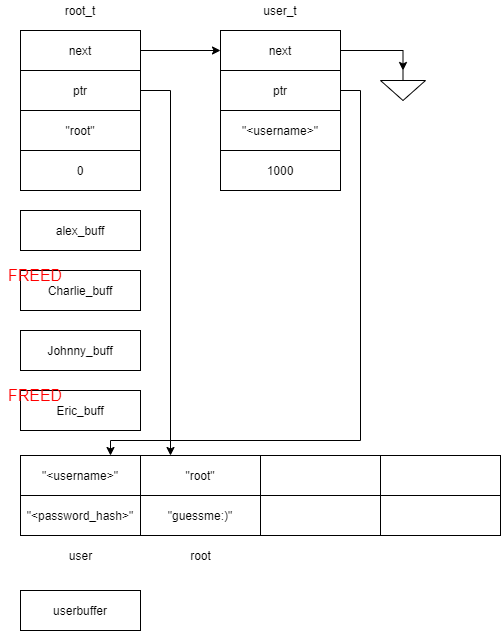

# CShell - corCTF 2021

- Category: Pwn
- Points: 459
- Solves: 81
- Solved by: drw0if - hdesk

## Description

My friend Hevr thinks I can't code, so I decided to prove him wrong by making a restricted shell in which he is unable to play squad. I must add that my programming skills are very cache money...

`nc pwn.be.ax 5001`

## Solution

We are given a binary file and its source code.
With a quick review we can spot some code mistakes:
- Inside the `history` function two pointers to heap allocated memory aren't cleaned up, if those are used we could achieve a use-after-free vuln
- Inside the `setup` function the `username` buffer, whose size is 8 bytes, is filled with `scanf` function reading up to 8 bytes. This could be a problem because scanf writes the null terminator so indeed 9 bytes are written
- Going on with the `setup` function we can spot a huge problem: the user can specify a size which is used to allocate a buffer on the heap, the size is not checked nor is the malloc return value. This could lead to an integer overflow and a segmentation fault via NULL dereference. The real problem though is the fact that after the buffer allocation, the buffer is used inside with `fgets` function to ask for a string, up to 201 bytes, but the buffer could be of any size, due to missing checks.
- Inside the `logout` function the for loop provides bad update stage since it executes `ptr = root_t->next` instead of `ptr = ptr->next`
- The whole program nests a lot of function call since the menu is called at the end of almost all the options, this could lead to a stack overflow, just like forgetting the base cases in a recursive algorithm.

At the end of the setup function we have this memory layout:



Since we can specify the size of `userbuffer` we can play with the `malloc fastbins` to allocate the buffer over a previously freed area.

If we specify `72` as the size we get the buffer over `Charlie_buff`, unfortunately starting from that address we can't reach the user and root structure.
If we ask for `120` and we write `201` bytes we achieve heap overflow and correctly overwrite `guessme:)` hash.

So if we overwrite the root password with a custom one we can then login as `root` and ask for a shell.

```
corctf{tc4ch3_r3u5e_p1u5_0v3rfl0w_equ4l5_r007}
```