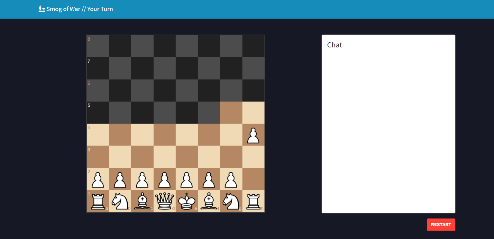
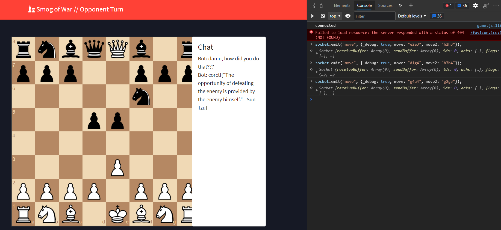

# corCTF 2021 - smogofwar

- Category: misc
- Points: 497
- Solves: 7
- Solved by: RxThorn

## Description

Hey, I made a chess website to play my favorite variant, smog of war! Why don't you check it out and play against my AI. He has some nasty surprises, but if you beat him I'll give you a flag.. good luck :)

https://smogofwar.be.ax

Source code provided.

## Solution

In this challenge, the website contains a chess game where you can play against a Bot and get a flag in case of victory. The peculiarity is that you can only see the boxes next to your pieces.



The first thing to look at is the communication: by moving a piece, the client sends to the server the UCI format for the move in a field called `data`, which is a string, via a websocket communication.

Looking at the code it is possible to see this piece:
```python
m0 = data
m1 = data

if isinstance(data, dict) and "_debug" in data:
    m0 = data["move"]
    m1 = data["move2"]
```
where `m0` and `m1` are used later in different functions.

We note that m0 and m1 are equal if `data` is just a string, but if instead of a string it is a dict containing the key `_debug` it is possible to make them different. So where are they used?

`m0` is the argument for the function `self.play_move` which updates the server-side saved board, while `m1` is the argument of `self.enemy.lemonthink` which does the same thing on the enemy's internal board. This means that it is possible to create two different matches with an interesting detail: the game gives you the win if you beat the black king on the server board while the enemy calculates its moves based on its own board.

The biggest limitation is that if the bot's possible moves are different from the game's ones, the match will end because of this snippet in the `normalthink` function in `enemy.py`, the one that calculates the next enemy move.
```python
if sorted(self.get_moves()) != sorted(possible_moves):
    self.quit = True
    self.chat("hey... wait a second...")
    return
```

So it is important to make moves that do not get in the way of the opponent.

Also when you lose you can see the position of all the pieces and therefore, since the moves are deterministic, know what moves the opponent is doing by repeating your same moves.

It is noted that by moving the two pieces further to the right, the opponent leaves a corridor free for the queen to the left who can move and capture the king.

So to win just run the following commands in the browser console:
```javascript
socket.emit("move", {_debug: true, move: "e2e3", move2: "h2h3"});
socket.emit("move", {_debug: true, move: "d1g4", move2: "h3h4"});
socket.emit("move", {_debug: true, move: "g4a4", move2: "g2g3"});
```

Then you can move the queen on the king and read the flag in the chat: `corctf{"The opportunity of defeating the enemy is provided by the enemy himself." - Sun Tzu}`


