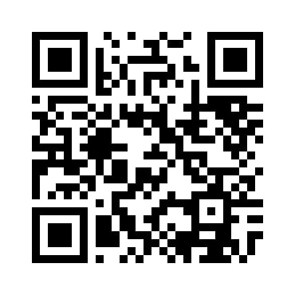

In this stego challenge with the following description:
```
One of my friends like to hide data in images.Help me to find out the secret in image.
```

We were given a .jpg file:


So the first thing to do is look for exif data:
```
$ exiftool stego.jpg
ExifTool Version Number         : 11.50
File Name                       : stego.jpg
Directory                       : .
File Size                       : 47 kB
File Modification Date/Time     : 2019:08:22 23:00:54+02:00
File Access Date/Time           : 2019:08:22 23:01:18+02:00
File Inode Change Date/Time     : 2019:08:22 23:01:12+02:00
File Permissions                : rw-r--r--
File Type                       : JPEG
File Type Extension             : jpg
MIME Type                       : image/jpeg
JFIF Version                    : 1.01
Exif Byte Order                 : Big-endian (Motorola, MM)
X Resolution                    : 1
Y Resolution                    : 1
Resolution Unit                 : None
Y Cb Cr Positioning             : Centered
Compression                     : JPEG (old-style)
Thumbnail Offset                : 202
Thumbnail Length                : 13391
Comment                         : Compressed by jpeg-recompress
Image Width                     : 1116
Image Height                    : 102
Encoding Process                : Progressive DCT, Huffman coding
Bits Per Sample                 : 8
Color Components                : 3
Y Cb Cr Sub Sampling            : YCbCr4:2:0 (2 2)
Image Size                      : 1116x102
Megapixels                      : 0.114
Thumbnail Image                 : (Binary data 13391 bytes, use -b option to extract)
```

Nothing here, let's move on looking for eventual appended files:
```
$ binwalk stego.jpg

DECIMAL       HEXADECIMAL     DESCRIPTION
--------------------------------------------------------------------------------
0             0x0             JPEG image data, JFIF standard 1.01
30            0x1E            TIFF image data, big-endian, offset of first image directory: 8
202           0xCA            JPEG image data, JFIF standard 1.01
```

Bingo! We have found one more jpeg appended at the end of the first one, let's try to extract it:

```
$ binwalk -e stego.jpg
```

Binwalk seems not to work. Let's try to extract it with dd:

```
dd if=stego.jpg of=2.jpeg ibs=1 skip=202
47597+0 records in
92+1 records out
47597 bytes (48 kB, 46 KiB) copied, 0.0625076 s, 761 kB/s
```

and the result is:



Let's decode it with a simple python script:

```python
#!/usr/bin/python

from pyzbar.pyzbar import decode
from PIL import Image
import sys

print(decode(Image.open(sys.argv[1]))[0].data.decode('utf8'))
```

```bash
./decoder.py 2.jpeg
d4rk{flAg_h1dd3n_1n_th3_thumbnail}c0de
```
