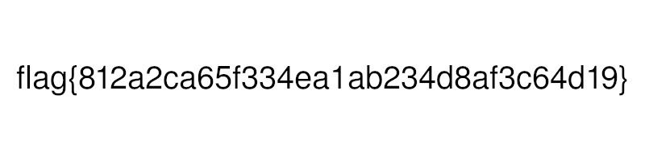

# 2ez - hacktivitycon 2021

- Category: Warmup
- Points: 50
- Solves: 518
- Solved by: Iregon, crypt3d4ta

## Description

These warmups are just too easy! This one definitely starts that way, at least!

## Solution

With the challenge we have a file: [2ez](2ez).

With file command we don't have any information:

```
$ file 2ez    
2ez: data
```

We can try to print the content with `xxd`:

```
$ xxd 2ez 
00000000: 2e32 455a 0010 4a46 4946 0001 0100 0001  .2EZ..JFIF......
00000010: 0001 0000 ffdb 0043 0003 0202 0202 0203  .......C........
00000020: 0202 0203 0303 0304 0604 0404 0404 0806  ................
00000030: 0605 0609 080a 0a09 0809 090a 0c0f 0c0a  ................
00000040: 0b0e 0b09 090d 110d 0e0f 1010 1110 0a0c  ................
00000050: 1213 1210 130f 1010 10ff c000 0b08 00c8  ................
00000060: 0320 0101 1100 ffc4 001d 0001 0003 0101  . ..............
...
```

Now we can see something like the signature of a JPEG file, but with some wrong bytes.

According to [wikipedia](https://en.wikipedia.org/wiki/List_of_file_signatures) the right JPEG file signature is: `FF D8 FF E0 00 10 4A 4649 46 00 01`.

Replacing the wrong bites we have now an image that contains the flag:



## Flag

```
flag{812a2ca65f334ea1ab234d8af3c64d19}
```
