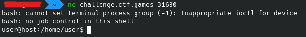
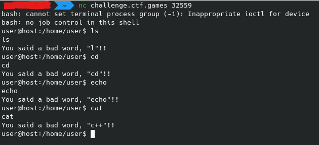
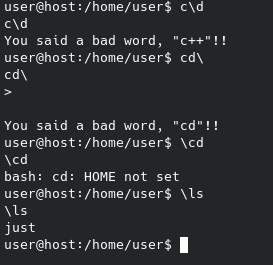
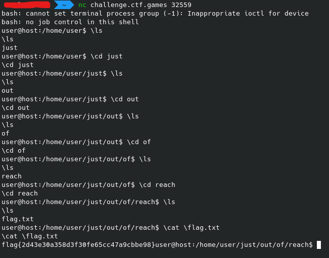

# Bad Words - hacktivitycon 2021

- Category: Misc
- Points: 50
- Solves: 629
- Solved by: Iregon

## Description

You look questionable... if you don't have anything good to say, don't say anything at all!

## Solution

We can connect to the challenge via nc.

After the connection we can see a shell:



Trying to typing some basic bash commands, in most of the cases we get blocked by the shell:



From the messages we can assume that there isn't a full name check on the command entered, but the check is executed one character at the time (for example: the `cat` command is recognized as `c++` command).

After some test with special characters, we noticed tha `\` before a command bypass the check and is ignored by bash:



So, we can now navigate into the shell ad search for the flag:



## Flag

```
flag{2d43e30a358d3f30fe65cc47a9cbbe98}
```