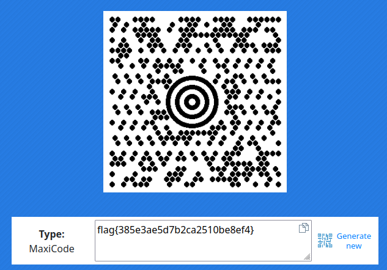

# Target Practice - hacktivitycon 2021

- Category: Warmup
- Points: 50
- Solves: 249
- Solved by: Iregon, crypt3d4ta

## Description

Can you hit a moving target?

**Note, this flag contains only 24 hexadecimal characters.**

## Solution

Withthe challenge we have a gif image:


First of all we need to split every single image of the gif, to do that we use [exgif.com](https://ezgif.com/split).

Then, we need to find what tipe of 2D code is this. To do that we simply use Google Images and we found that is a code named `MaxiCode`.

With an online Maxicode reader we try to scan, one by one, the 21 images from the gif.

we found that the flag is in the image number 15 (16 if you start cont from 1):



## Flag

```
flag{385e3ae5d7b2ca2510be8ef4}
```
