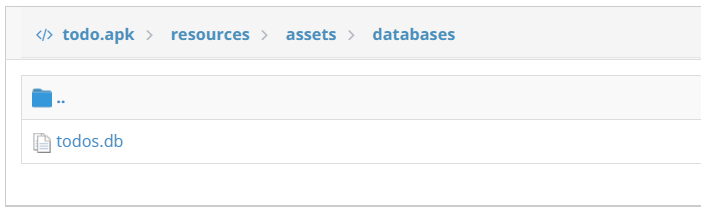
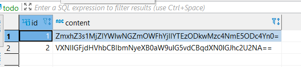
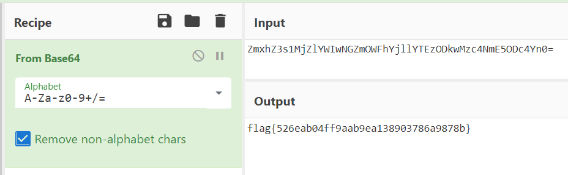

# To Do - hacktivitycon 2021

- Category: Mobile
- Points: 50
- Solves: 426
- Solved by: Iregon

## Description

I made my own app to remind me of all the things I need to do.

## Solution

With the challenge we have a [todo.apk](todo.apk) file. We use [http://www.javadecompilers.com/apk](http://www.javadecompilers.com/apk) to decompile it.

Searching through te java files we can see one named `MyDatabase.java` in `sources/com/congon4tor/todo`:

```java
package com.congon4tor.todo;

...

public class MyDatabase extends SQLiteAssetHelper {
    private static final String DATABASE_NAME = "todos.db";
    private static final int DATABASE_VERSION = 1;

    ...
}
```

Now we know that the app use a SQLite db named [todos.db](todos.db).

Searching for this file, we can find it in `resources/assets/databases`:



In the db we can find two tables: `todo` and `android_metadata`.

In `todo` table we have two records:



Decoding the first record from Base64 we have the flag:



## Flag

```
flag{526eab04ff9aab9ea138903786a9878b}
```