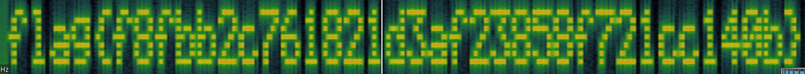

# Tzunami - hacktivitycon 2021

- Category: Warmup
- Points: 50
- Solves: 733
- Solved by: Iregon, crypt3d4ta

## Description

Woah! It's a natural disaster! But something doesn't seem so natural about this big wave...

## Solution

With the challenge we have an audio file [tzunami.wav](tsunami.wav).

Playing the file we can listen a strange sound at the end.

Opening the audio file with one spectrum visualizer's software (in our case we used Sonic Visualizer) we can see the flag at the and of the spectrum:



## Flag

```
flag{f8fbb2c761821d3af23858f721cc140b}
```