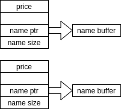
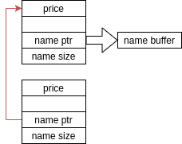

# Pawned - hacktivitycon 2021

- Category: Pwn
- Points: 494
- Solves: 26
- Solved by: drw0if - hdesk

## Description

Welcome to our pawn shop. Only used items are allowed.

## Solution

### Overview
The program we are dealing with is a common shop application, we can:
- add an element specifying the price, the length of the name and the name itself
- "delete" an element buying it
- print the elements list

Whenever we create a new element the program allocates a 32 byte structure made up by:

| Offset | name |
|--------|------|
| 0 | price |
| 16 | pointer to name buffer |
| 24 | buffer size |

asks us for the price and stores it inside the structure, then asks us for the name size, stores it inside the struct, allocates a new buffer with the specified size, stores the pointer and then reads up the name.

When we buy one of the item it firstly frees the buffer then frees the struct element and stop. The pointers to the areas are still present, this leads to a `use-after-free` vulnerability.

Reading the code more closely we can find an hidden menu option: we can `manage` an item which means we can change the values of an item, the price and name itself. During this procedure if we specify a different name size the buffer is freed and reallocated, if we specify the same size as before the buffer is reused as it is.

Let's use `pwninit` to downlad a loader and patch the elf to use the provided libc:
```bash
pwninit --bin pawned --libc libc-2.31.so
```
Now we can run the program simply with `./pawned_patched` and it will use the correct libc version.

### Heap layout
Allocating a couple of chunk our heap layout will be:



To achieve `arbitrary read/write primitives` we need to build this layout:



If we achieve this layout we can manage the second block and write an arbitrary address to the first one, then to read we need to print the blocks, the first block will follow it's `name pointer` and read at the specified address. To write wherever we want we can place the address into the first block as the `name pointer`, then use the manage function on the first block, specify the same size and write what we want.

### Exploitation
To achieve our memory layout we can use the `fastbin` chunk allocation algorithm:
- add an item with 32 bytes of name so that the program will allocate two chunks of 32 bytes
- add an item with 10 bytes of name, the program will call malloc firstly with 32 then with 10
- delete the first item so that the program frees the buffer ad then the item structure, in this way we add items to the fastbin linked list and the head of the list will be the struct itself
- manage the second structure and specify 32 byte as the size, in this way it will free the 10 byte buffer and allocate a new 32 byte one, the algoritm will search for an already freed chunck and it will return the first chunck

Once we have built the layout we can think to hijack the control flow. We need to leak a libc address to calculate `system` address. Turns out that togheter with the fastbins there are also the `unsorted bins` that can be used togheter with a `use-after-free` to leak a libc address.

So we need to add two large elements (for example 2000 bytes), then free the first one and a libc address will pop inside the heap memory. Now we can read the record and parse the address.

Now we can write arbitrarily, read arbitrarily and we have a libc address, to hijack the control flow we decided to use the `__free_hook` variable since the binary has `full RELRO` and no GOT can be re-written.

We wrote `system` addresso to `__free_hook`, added a new item with the string `/bin/sh` to the list and then freed it.

