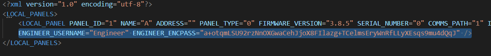
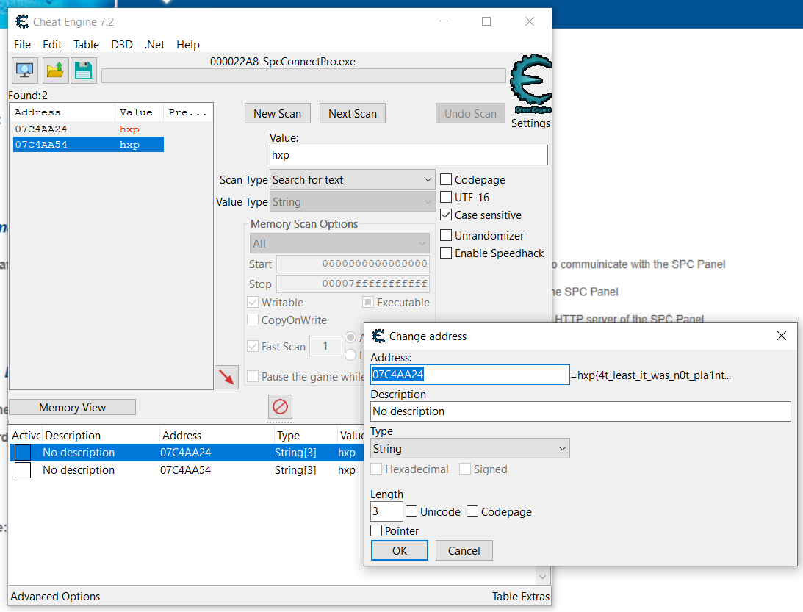
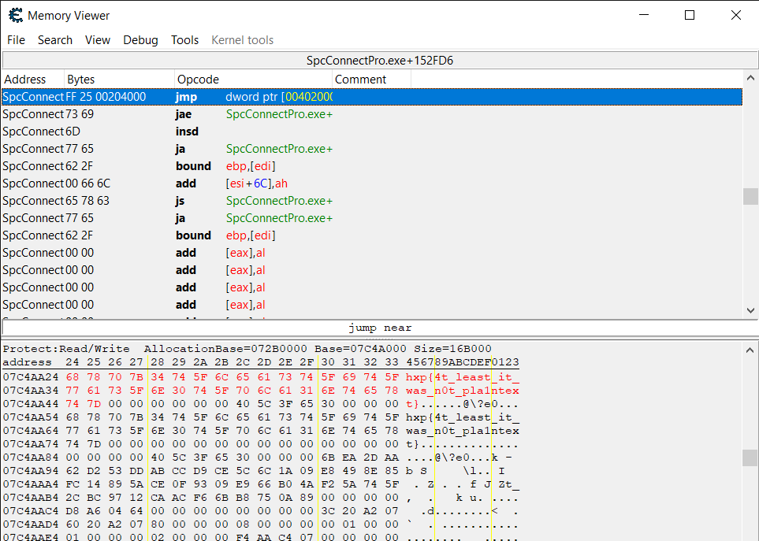

# Secure Program Config - hxp CTF 2020

## Description

Due to corona, I’m in home office and yesterday, I (while not being completely sober) played around with some alarm systems of the clients and … apparently … changed my engineer password since I cannot access anything anymore … my boss has called this morning and threatened to fire me if I don’t fix that ASAP … I have not the slightest idea what my password could be or how I can get it back … can you please help me recover it???!! I have to fix that mess somehow …

I removed the clients’ data to not get into even more trouble …

Before I forget: Download ██████████ and start it pointing to the folder █████. (The software will ask you which directory it should use)

Our company login to the software is admin/admin. Luckily, I did not change that …

Oh no … my boss is calling again … we talk later … good luck.

## Solution

The challenge required to install a software for Windows called SPC Connect Pro. After a bit of hesitation, we decided to install it on one of our personal computers.

With the setup executable we were also given an archive containing some XML files, some configuration files, indeed we had to put them in the installation directory of SPC Connect Pro.

After the initial setup, we were able to open the software and log in with `admin`/`admin`, as told in the description.

One of the XML configuration files (`Panels.xml`) contained an encrypted password for the Engineer but we had to understand how the program encrypted it. We didn't want to do reverse engineering so we found an easier way.

By surfing in the GUI we found a panel with some credentials: a username `Engineer` and a password hidden by asterisks. We were able to append characters to that password! This means that the software knows which is the password and can edit that, so it isn't hashed but encrypted.

But... if the software knows which is the password, it stored that somewhere in the memory.

As suggested by one of our members (drw0if) we downloaded `windbg` to do the debug of the software and see what happens when we append characters to the password. There was just a problem: none of us knew how to use it and we ended up giving up because we couldn't read the memory. We opted for an easier (and funnier) way to read the memory: `Cheat Engine`, the software that every middle school student used at least one time to try to hack `Metin 2`.

From there it was all easy: we connected Cheat Engine to the process of SPC Connect Pro with the panel with the password opened and started a search for a string containing `hxp`. Some results, hooray! No.

Cheat engine didn't show us the complete string but only a part of the beginning, we could have increased the string length on the Cheat Engine result but we found out later. We decided to change strategy and use the `Memory View` instrument and searched for some text containing `hxp{` and there we found the flag: `hxp{4t_least_it_was_n0t_pla1ntext}`

