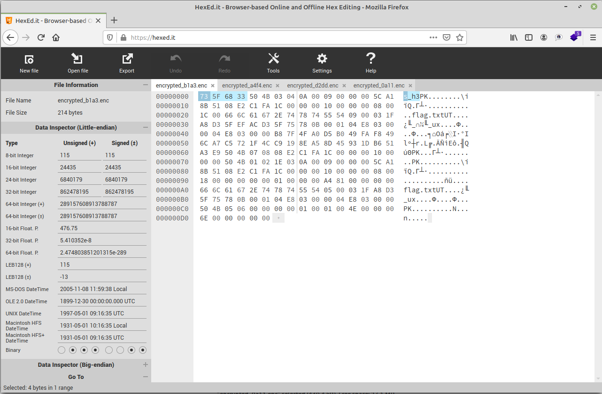
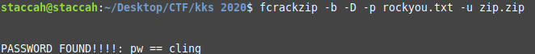

# Encrypted Storage 1
Category: Forensics

Points: 359

Solved by: staccah_staccah

## Problem

Our client was attacked by some ransomware. Maybe it was separatist dwarves?
He send us encrypted filesystem. Decrypt it, he need some data from secure storage.

## Writeup

Let's start by analyzing the file with the file command and see that it is an ext4 filesystem.
We mount it with the command:
```
mount -t ext4 filesystem /mnt/disk1
```
Here we find 4 folders, each with a file inside that appears to be corrupt.
Analyzing their hexdump, however, we can see that 4 bytes have been added to the beginning of each file.

By removing them (and saving them for later) we get the original files.
In particular, one of the files is a zip in which there is a flag.txt file, but to extract it you need a password.
After looking in vain for password clues within the other files, I tried bruteforce and it worked:


Finally we find the flag contained in flag.txt: `kks{n0t_s3cur3}`
