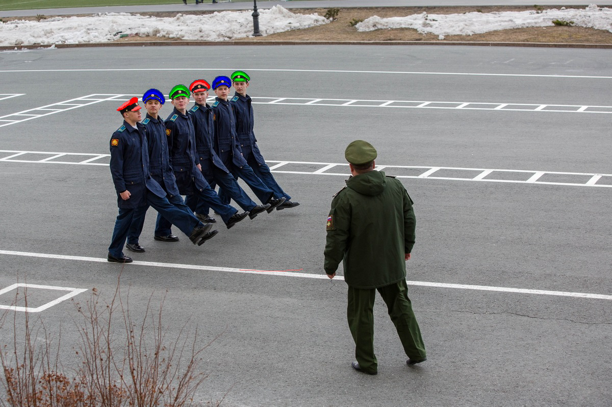
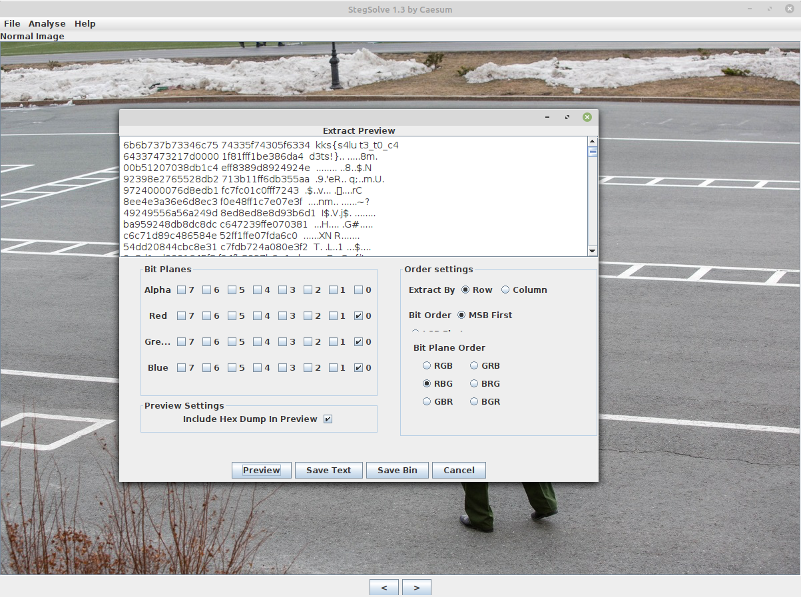

# Red Green Blue Cadets
Category: Forensics

Points: 411

Solved by: staccah_staccah

## Problem

Our spy take this picture from KGB special school. They have strange uniform, doesn't it?

## Writeup

Opening the image we immediately notice that the military caps are colored with 3 colors: Red, Blue and Green. A clear reference to RGB but in a different order, namely RBG.
Using the Data extract option on StegSolve and setting RBG we get the flag:

flag: `kks{s4lut3_t0_c4d3ts!}`
