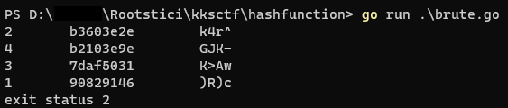
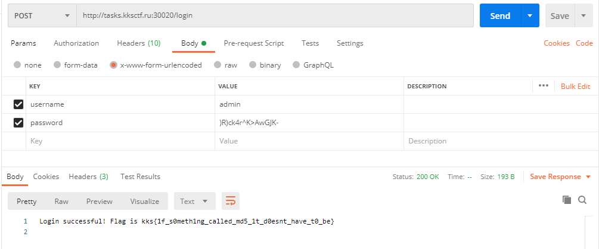

# hashfunction

Info:
- Category: web
- Points: 513
- Solved by: hdesk, SM_SC2, 0xThorn

## Problem

One solution for storing passwords securely in applications is to store a hash of the password. Or it's not?
http://tasks.kksctf.ru:30020/

[server.go](server.go)

## Writeup

Inspecting the code and doing some tests we can see that each 8-characters-long digest's block is related only to one 4-characters-long block of the provided password.
For example

| Password | Hash                                        |
|----------|---------------------------------------------|
| 1234     | **553b6a59** 52d04dc2 0036dbd8 313ed055     |
| 12341234 | **553b6a59** **553b6a59** 3f1cf75d 7068baae |

So, the idea is to brute force, on our local machine, only the first 8 characters of the whole password.

[brute_force.go](brute_force.go)

After few seconds, we obtain the following results.


        
The password is `)R)ck4r^K>AwGJK-`

In order to obtain the flag we have to send a `x-www-form-urlencoded` POST request to `http://tasks.kksctf.ru:30020/login` with the following data:

```
username : admin
password : )R)ck4r^K>AwGJK-
```


      
### Flag: 
```
kks{1f_s0meth1ng_called_md5_1t_d0esnt_have_t0_be}
```
