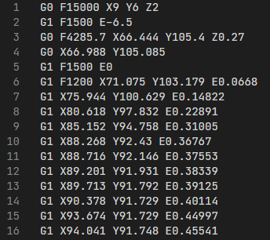
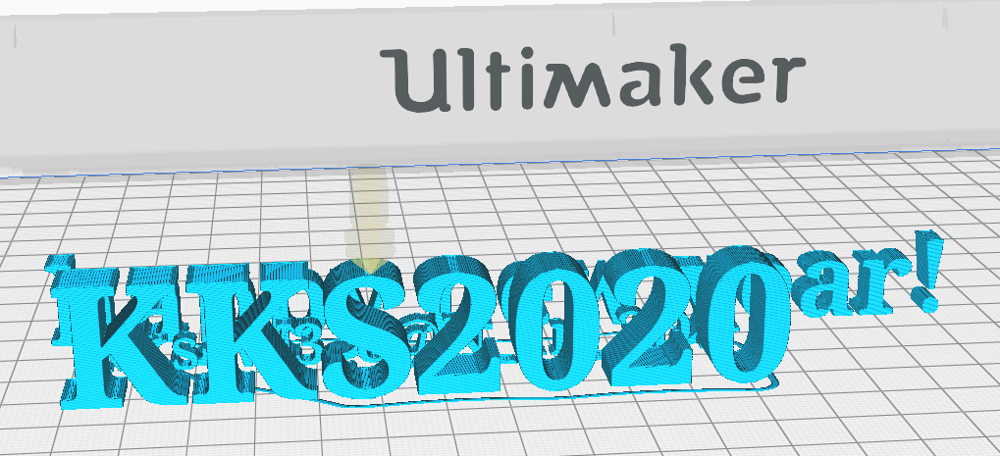
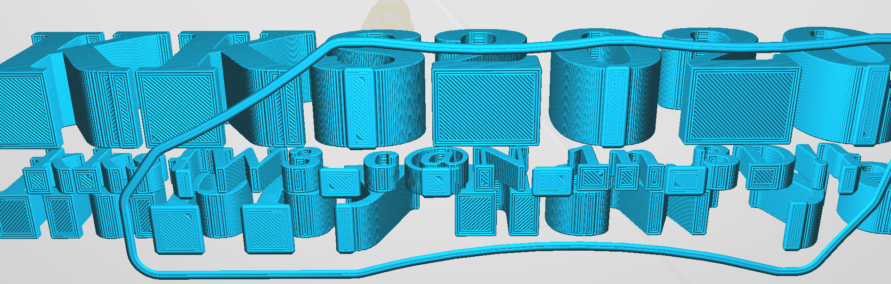

# motor_sounds

Category: Misc

Points: 268

Solved by: Iregon

## Problem

Жжжжжжжжжж, виииив, виииив, жжжжжжжж...

Zhzhzhzhzhzhzhzhzhzh, viiiiv, viiiiv, zzhzhzhzhzhzhzh ...

## Writeup

If we open the [file](https://drive.google.com/file/d/1gzn3XE3FKk-1pMXR9QPUPm1OpxSgw-mK/view?usp=sharing) that is given to us with any text editor we notice that inside it there are some writings that can be identified as GCODE, the following is an extract:



Since the GCODE is used to encode the actions that are sent to a 3D printer, let's try to open the file with a slicing program for 3D printers (Ultimaker Cura will be used in the following examples):
 


We immediately notice that there are 3 writings, by rotating them in a position that allows us to read the central writing we will be able to see the flag:



## Flag: 
```
kks{W3_c@N_1n_3D!}
```
