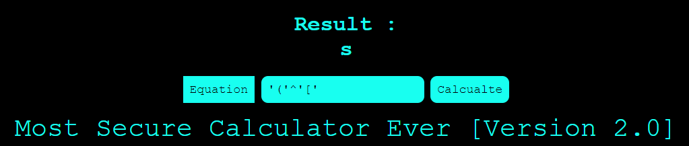
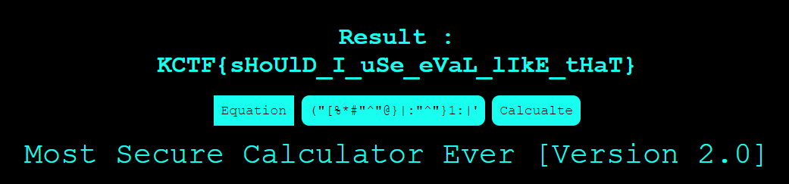

# Most Secure Calculator 2 - knightctf

- Category: Web
- Points: 250
- Solves: 135
- Solved by: raff01

## Description

Challenge Link : http://198.211.115.81:9004/

## Solution

The challenge is the sequel of [Most Secure Calculator 1](https://github.com/r00tstici/writeups/blob/master/knightctf/most_secure_calculator_1/README.md). Now there's a regex and we can't use letters but only numbers and special chars. So we have to find another way to inject PHP code.
We can use XOR operator! Example: `'(' ^ '[' = 's'` infact the result will be:



Now we have to compose commands. The input has a length limit so we can't create commands char by char, we have to use longer strings... in order to do this we can use a tool called [XORpass](https://github.com/devploit/XORpass). It permits to convert normal text into XOR expressions. Let's prepare the payload, we will use the PHP function `file()` to open `flag.txt`. The result is an array of text lines so we have to access the first one by adding `[0]`:

```
file("flag.txt")[0] == ("[%*#"^"@}|:"^"}1:|")("4?1`~~.)"^"}}+|.3-#"^"/.{{~9{~")[0]
```



## Flag
KCTF{sHoUlD_I_uSe_eVaL_lIkE_tHaT}


