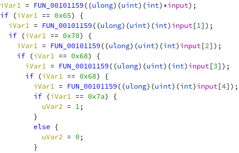
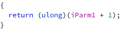

In this reverse challenge we were given a ELF (look at generic_crackme):

So the first thing to do is to open it in ghidra and understand the business logic:

This is the main function:


We are asked to input a string of 0x100 character at maximum, then is called a check function on the input, the core of the check is:



It simply compares the result value of another function in which is passed the characters of the input one by one with fixed values. This function is:



As we can see it simply increments the value passed and returns it. So the solution is given by this simple script:

```python
#!/usr/bin/python3

hex = [0x65, 0x70, 0x68, 0x68, 0x7a]
hex = [chr(x-1) for x in hex]

print('flag{' + ''.join(hex) + '}')
```

```
flag{doggy}
```