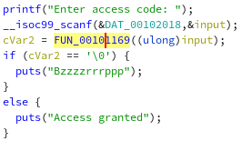
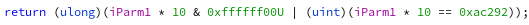

In this reverse challenge we were given a ELF (look at generic_crackme_redux):

So the first thing to do is to open it in ghidra and understand the business logic:

This is the main function:




We are asked to input a string, then is called a check function on the input, the core of the check is:



So the flag is:
```
flag{70517}
```